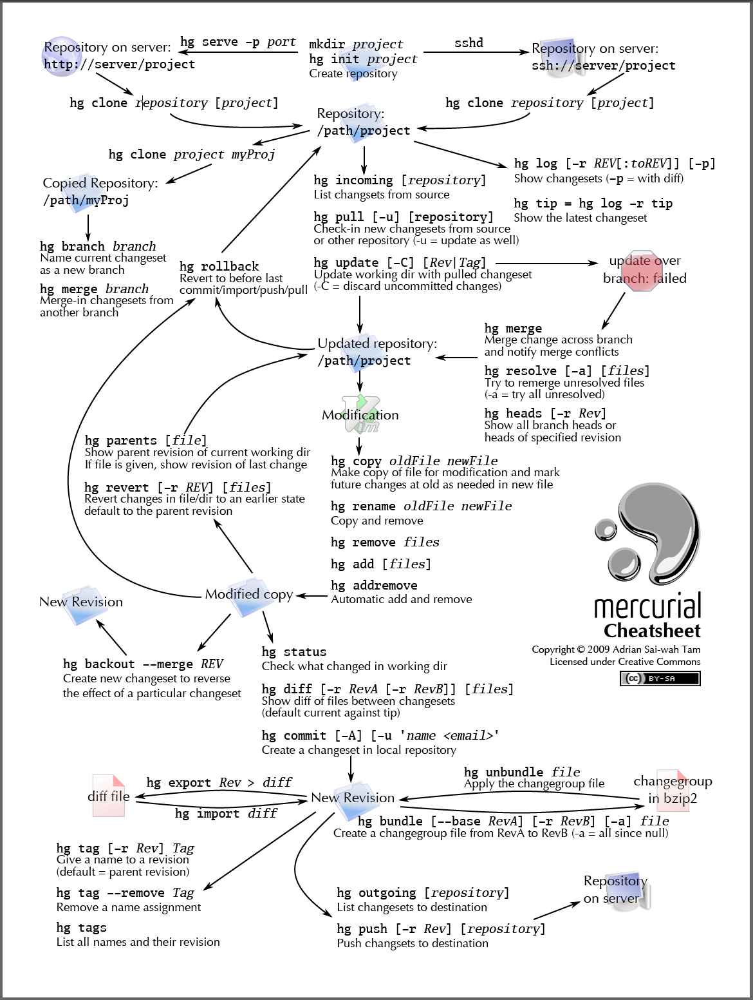

# Hg


## 正常流程

```js
  # 查看项目状态
  hg st

  #将未加入索引的文件加入索引
  hg add 文件 
  或者 
  hg add . 

  # 提交修改
  hg ci -m "提交说明"

  # 初次推送代码
  hg push --new-branch

  # 非初次推送代码
  hg  push -b 分支号

```

## 分支管理 

```js
  # 新建分支
  hg branch  分支号

  # 查看当前分支
  hg branch 

  # 查看所有分支
  hg branches

  # 切换分支
  hg update 分支号

  # 合并分支
  hg merge 分支号
  或者 
  hg merge  // 即是不加分支号，此时合并自己分支的多个head头，多用于多人操作同一分支后，进行合并操作
```


## 更新操作

```js
  # 更新当前项目状态
  hg update 

  # 更新代码
  hg pull

```

## 回退操作

```js
  # 代码未提交时（即没有进行 hg ci -m "提交" 操作），还原代码
  hg revert 文件名 
  或者 hg revert -a 还原所有修改

  # 代码提交了一次，还原提交，此时修改的代码还在，特别注意，此操作只能还原一次，多次是不行的
  hg rollback 

```

## hg 使用图解

> hg 各种命令及其之间的联系


> hg 使用指导




