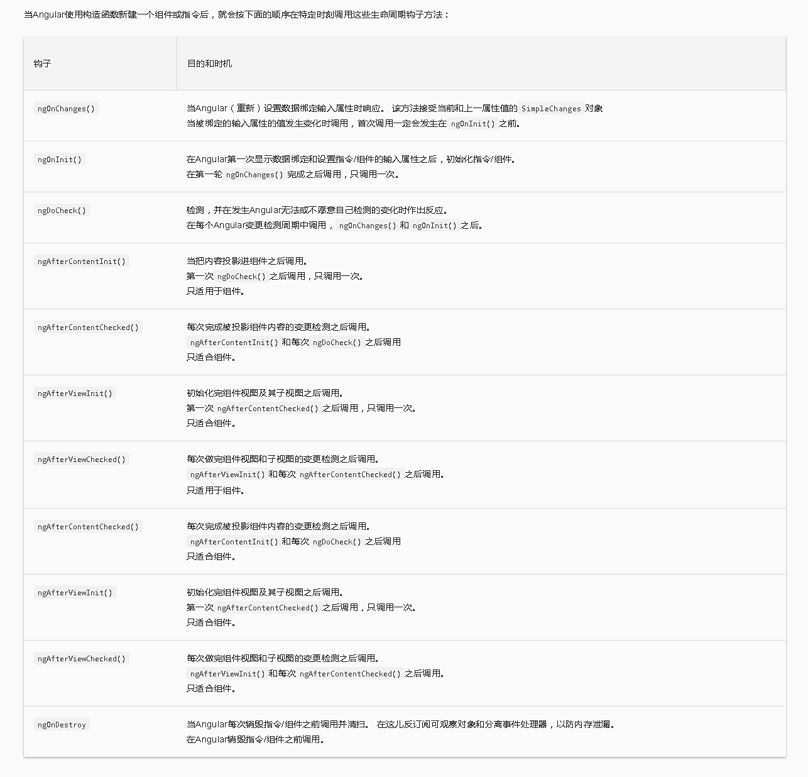

# Lifecycle Hooks

- 什么是钩子
	> 钩子(`hook`)就是一些具有既定生命周期的框架工具，在生命周期的各个阶段预留给用户执行一些特定操作的口子，这其实是一种面向切面的编程。

	+ [钩子函数的运行机理](https://juejin.im/post/5a1b5324f265da43305e2dfa)

- 生命周期的顺序
	

- 组件生命周期钩子
	+ 指令和组件的实例有一个生命周期： 新建、更新、销毁。
	+ 通过实现一个或多个`Angular core`库里定义的生命周期钩子接口，开发者可以介入周期中的各个阶段。
	+ 每个接口都有唯一一个钩子方法，钩子命名由接口名加上`ng`前缀构成。
	+ 如：`OnInit`接口的钩子方法叫做`ngOnInit`，`Angular`在创建组件后会立即调用它。
	+ 没有指令或组件会实现所有这些接口，并且有些钩子只对组件有意义。
	+ 只有在指令、组件中定义过的那些钩子方法才会被`Angular`调用。
	
	```js
		export class PeekABoo implements OnInit {
			constructor(private logger: LoggerService){
				ngOnInit() { this.logIt(`OnInit`); }
				logIt(msg: string) {
					this.logger.log(`#${nextId++} ${msg}`);
				}
			}
		}
	```

