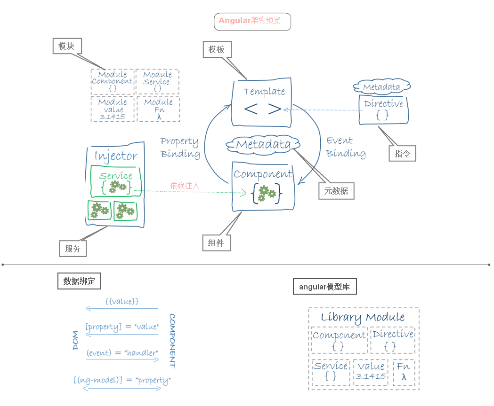

# Introduce

<u>以下`ng`代指`Angular`</u>

> Angular架构预览 

## 八大基础知识

  - 模块
  	+ ng应用的模块化系统中，模块被称为`Angular模块`或者`NgModules`
  	+ 每个ng应用都至少有一个模块(根模块-AppModule)
  		* 根模块用来引导并运行应用。
  		* 最初应用可能就只有一个单一的根模块，等应用复杂，将会拆分到多个"特性"模块中。
  		* 特性模块只会在用户访问到这些特性的时候才会加载(即惰性加载)。
  	+ ng模块都是一个带有`@NgModule`装饰器的类 
  		* `declarations` - 声明本模块中拥有的视图类。必须在`@NgModule`类声明每一个组件，否则当使用该组件时会报错。ng 有三种视图类：组件、指令和管道，有且只有上述三者可添加至该数组中。
			* `exports` - `declarations` 的子集，可用于其它模块的组件模板。
			* `imports` - 存放本模块声明的组件模板需要的类所在的其它模块，其放置只能是`NgModule类`。
			* `providers` - 服务的创建者，提供商添加到根模块上，加入到全局列表中，可用于应用的任何部分。
			* `bootstrap` - 指定应用的主视图（称为根组件-AppComponent），它是所有其它视图的宿主。只有根模块才能设置`bootstrap`属性。在启动过程中，其中一步是创建列在`bootstrap`数组的组件， 并将它们每一个都插入到浏览器的DOM中。每个被引导的组件都是它自己的组件树的根。 插入一个被引导的组件通常触发一系列组件的创建并形成组件树。
		+ 引导过程
			* 开始时，使用即时编译器(JIT)动态编译应用。在`src/main.ts`中引导即时编译的浏览器应用。
			* 动态创建浏览器平台，并引导`AppModule`。
			* 搭建运行环境，从根模块(`AppModule`)的`bootstrap`数组中提出根组件(`AppComponent`)，创建该组件实例，并将其插入到组件`selector`标识的元素标签中，在该标签中显示根组件的实例。
  - 组件
  	+ 组件控制着视图
  	+ 在类中为组件定义应用逻辑(属性和方法等)
  	+ 组件通过一些由属性和方法组成的API与视图交互
  	+ 在与用户交互过程中，组件会被创建、更新和销毁(组件的生命周期)
  	+ 通过<b>生命周期钩子</b>在组件生命周期各个时间点上插入操作，
  - 模板
  	+ 通过组件自带的模板来定义组件视图(template\templateUrl)。
  - 元数据
  - 数据绑定
  - 指令
  - 服务
  - 依赖注入

## 其他特性和服务

  - 动画
  - 变更检测
  - 事件
  - 表单
  - HTTP
  - 生命周期钩子
  - 管道
  - 路由器
  - 测试

