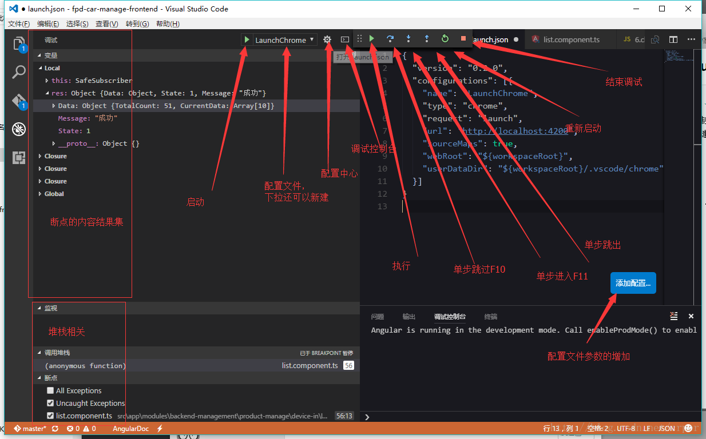
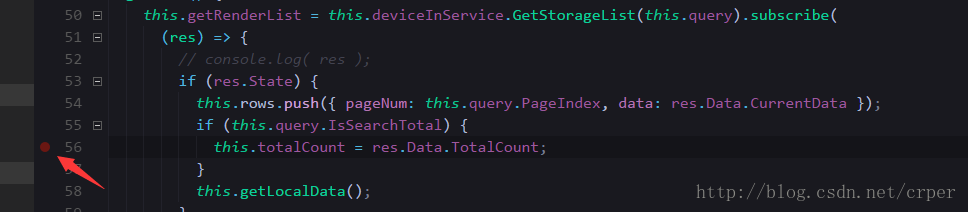
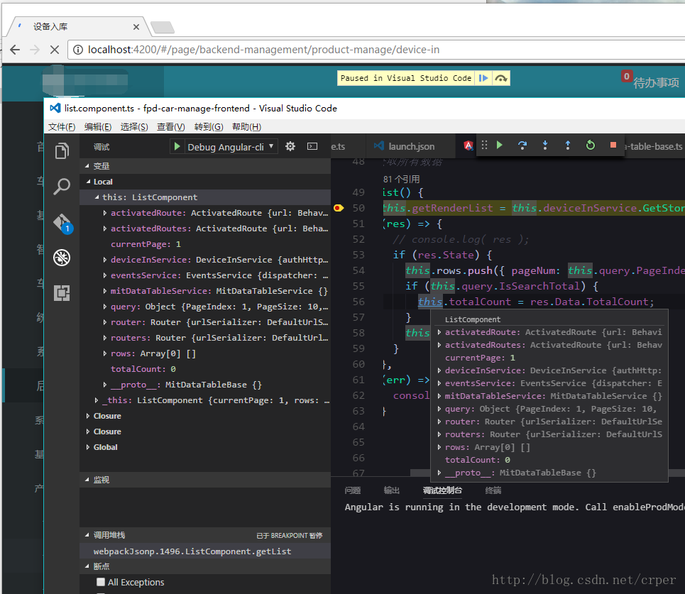

# 高级用法

## `Vs Code Debug(Ctrl + Shift +D)`

  - `debug` 前奏
    

    **部分快捷键**

      1. 继续(F5)
      2. 单步跳过(F10)
      3. 单步调试(F11)
      4. 单步跳出(Shift + F11)
      5. 重启(Ctrl + Shift + F5 )
      6. 停止/结束(Shift + F5)

    **安装插件**

     [Debugger for Chrome](https://marketplace.visualstudio.com/items?itemName=msjsdiag.debugger-for-chrome) : Debug your JavaScript code in the Chrome browser, or any other target that supports the Chrome Debugger protocol.

      > 简言之：就是让你的代码在chrome上调试，为什么vscode不集成这个，可能控制体积大小什么的。。

      > 记得`ng serve`要先行启动,调试是调试，不包括引导`angular-cli`的启动;

      配置文件很简单：

      ```js
      {
        "version": "0.2.0",
        "configurations": [{
          "name": "LaunchChrome",
          "type": "chrome",
          "request": "launch",
          "url": "http://localhost:4200",
          "sourceMaps": true,
          "webRoot": "${workspaceRoot}",
          "userDataDir": "${workspaceRoot}/.vscode/chrome"
        }]
      }
      12345678910111213
      ```

      **配置解释**

       - `version`: 你定义这个配置文件的版本，默认是0.2.0，生成的时候
       - `configuration`：配置域
       - `name`：配置文件的名字，比如你可以叫做`Debug Angular-cli`
       - `type`：调试的类型，vscode天生支持`node`,比如`go`,`php`,`chrome`这些就依赖插件啦
       - `request` : 配置文件的请求类型，有`launch`和`attach`两种，具体看官方文档
       - `url`:这个是chrome插件带的，指定访问的链接
       - `webRoot`：也是chrome插件带的，指定根目录或者执行文件
       - `${workspaceRoot}`:就是你打开vscode读取的项目目录
       - `sourceMaps`:默认是启用的，对于打包的调试，小伙伴们必须开启
       - `userDataDir`：临时目录,专门保存调试过程产生的东西

  ------

  - 启动调试

    1. 正确的情况下就会弹窗一个新的chrome页面，
    2. 打断点很简单，就直接在你需要断点的页面，点行号靠左的地方，有个小红点的地方，点击出来红色就是打上了(小红点再点击一次就是取消)，如图： 
       
    3. 打开相应的页面，执行到响应的代码块就会触发debug了。。然后vscode就可以看到你想瞅瞅的数据了。。调试过程（单步什么的）,对应的本地文件会显示数据变动在你的
       

  ------

  - 总结

    **VS Code**的Debug功能相当好用，若是想引导程序启动再打开chrome这种也可以实现，就是需要写的配置文件比较繁琐，很花时间;

    除了天生支持node内置debug,以下的都需要借助插件才可以

      1. C#
      2. Python
      3. Chrome
      4. C/C++
      5. Go
