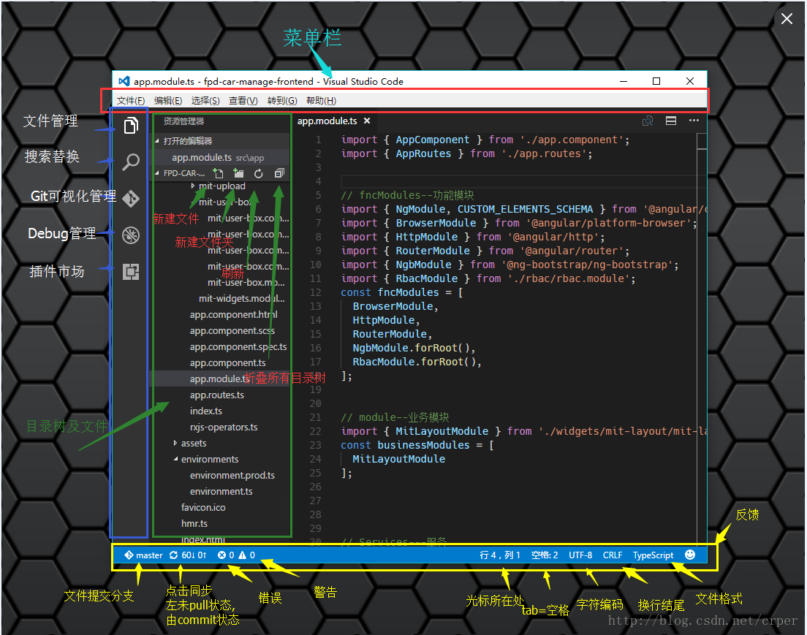
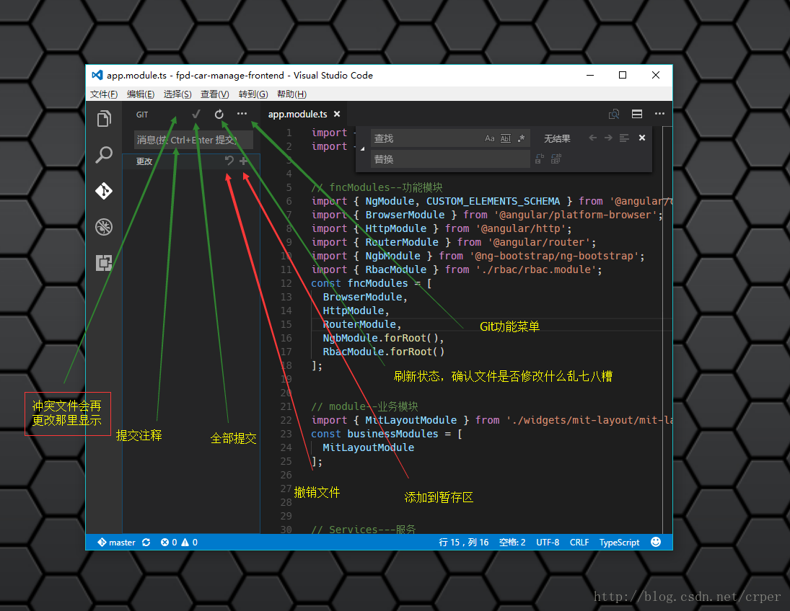
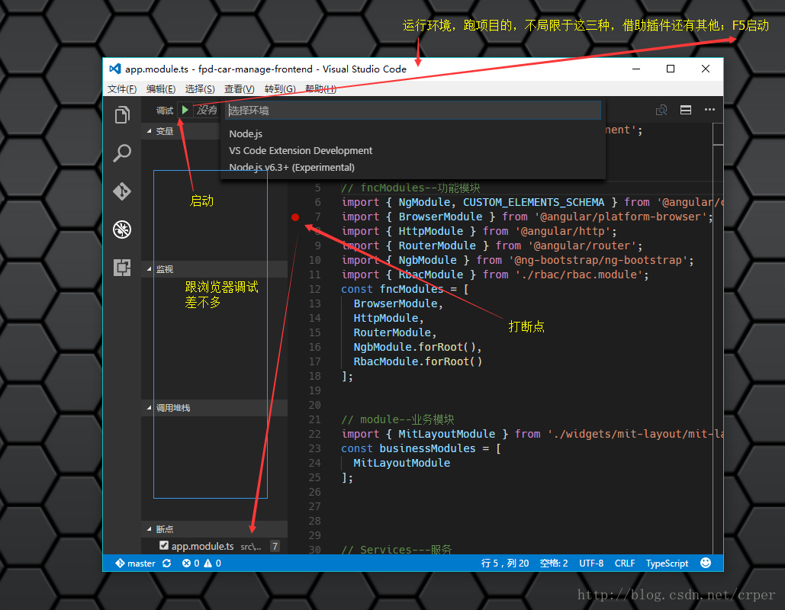
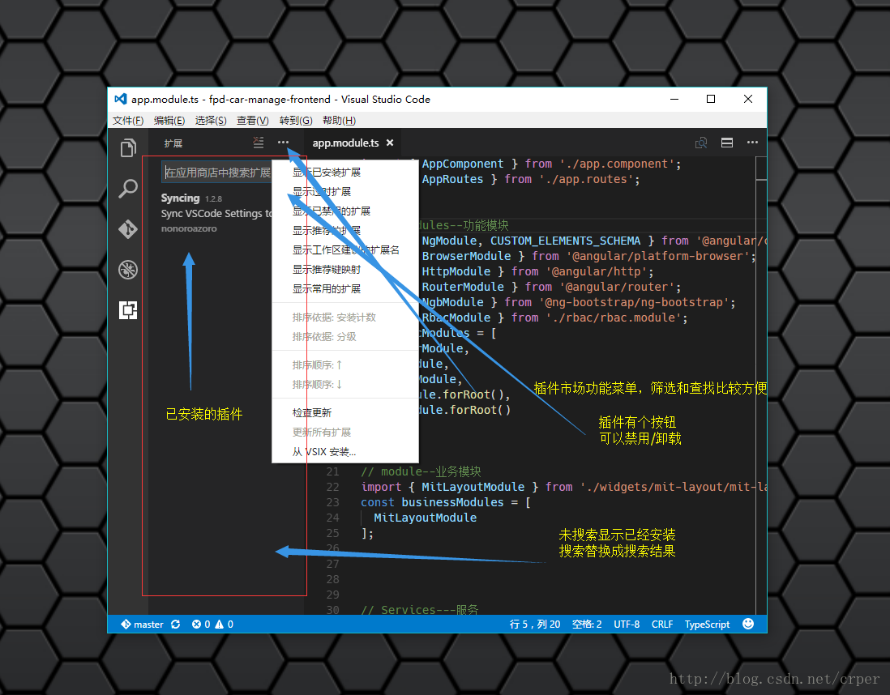

# 插件安装

  - [插件市场](https://marketplace.visualstudio.com/VSCode)

  ------

  - 启动界面：快捷键（Ctrl + Shift + E）

  

  ------

  - Search && replace：快捷键（Ctrl + Shift + H）

  

  ------

  - Git：快捷键（Ctrl + Shift + G）

  

  ------

  - Debug：快捷键（Ctrl + Shift + D）

  

  ------

  - Extend：快捷键（Ctrl + Shift + X）

  
