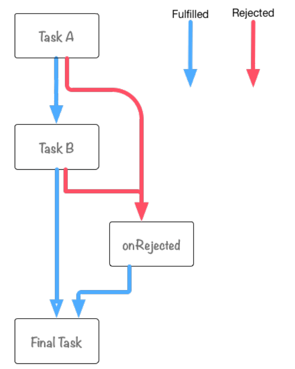

# Promise对象

## 背景

> 单线程

- js 执行环境是"单线程"的，一次执行一件任务，多任务要排队，前面一个任务完成，再执行后面的任务；
- "单线程"，当某段js代码长时间运行，页面就卡在这里，其他任务无法执行，就会出现浏览器无响应(假死)，如`Ajax`请求返回结果。

> 同步和异步

- js 将任务的执行模式分为：同步和异步
- 同步往往用于一些简单、快速、不涉及IO读写的操作
- 异步操作流程：
   - 异步操作将每个任务分成两段；
   - 第一段代码包含对外部数据的请求；
   - 第二段代码被写成一个回调函数，包含了对外部数据的处理；
   - 第一段执行完，不是立马执行第二段代码，而是将程序的执行权交给第二个任务；
   - 等到第一个任务的请求的外部数据返回了，再由系统通知执行其第二段代码。
  
> "异步模式"编程方法

- 回调函数

> 回调函数是异步编程最基本的方法

```js
function f1(callback) {
  // f1 的代码

  // f1 执行完成后，调用回调函数
  callback();
}

f1(f2)
```

- 事件监听

> 采用事件驱动模式

```js
function f1(){
  setTimeout(function () {
    // f1的任务代码
    f1.trigger('done');
  }, 1000);
}
f1.on('done', f2);
```

- 观察者模式

```js
jQuery.subscribe("done", f2);

function f1(){
  setTimeout(function () {
    // f1的任务代码
    jQuery.publish("done");
  }, 1000);
}

```

> 异步操作流程控制

- 串行执行：通过编写一个流程控制函数，来控制异步任务，将任务逐个执行；

```js
var items = [ 1, 2, 3, 4, 5, 6 ];
var results = [];
function series(item) {
  if(item) {
    async( item, function(result) {
      results.push(result);
      return series(items.shift());
    });
  } else {
    return final(results);
  }
}
series(items.shift());
```

- 并行执行：将所有异步任务同时执行；

```js
var items = [ 1, 2, 3, 4, 5, 6 ];
var results = [];

items.forEach(function(item) {
  async(item, function(result){
    results.push(result);
    if(results.length == items.length) {
      final(results);
    }
  })
});
```

- 串行和并行结合：通过设置门槛，每次最多执行n个异步任务，已避免了过分占用系统资源。

```js
var items = [ 1, 2, 3, 4, 5, 6 ];
var results = [];
var running = 0;
var limit = 2;

function launcher() {
  while(running < limit && items.length > 0) {
    var item = items.shift();
    async(item, function(result) {
      results.push(result);
      running--;
      if(items.length > 0) {
        launcher();
      } else if(running == 0) {
        final(results);
      }
    });
    running++;
  }
}

launcher();
```


## 什么是`Promise`


```js
  var promise = new Promise(function(resolve, reject){
    // ...
  })
```

- `Promise`运行机制：

  - `Promise`对象是用来处理异步请求的构造函数，从它可以获取异步操作的消息。
  - `Promise`起到代理作用，充当异步操作与回调函数之间的中介。
  - `Promise`提供统一的`API`，各种异步操作都可以使用同样的方法进行处理。
  - 使得程序具备正常的同步运行的流程，回调函数不必再一层层嵌套。
  - `Promise`的思想是，每个异步任务立即返回一个`Promise`对象，由于是立刻返回，固可采用同步操作的流程。
  - 同时其`then`方法，允许指定回调函数，在异步任务完成后调用，`then`方法能够获取到`resolve`及`reject`回调函数传入的值。
  - 首先使用`new Promise`方法创建`promise`对象；再使用`.then`或`.catch`添加`promise`对象的处理函数。

- `Promise`对象特点：
  + 三种状态：`Pending`(进行中)、`Fulfilled`(已成功)、`Rejected`(已失败)， 只有异步结果可以改变其状态。
  + 其状态改变后不可变Resolved(已定型)，但任何时候都可以得到这个结果，这点区别于事件监听。

- `Promise`对象缺点：
  + 一旦新建其实例对象，就立即执行无法取消；
  + 如果不设置回调函数，外部无法获取其内部抛出的错误；
  + 其处于`Pending`状态时，无法确定异步操作是刚刚开始还是即将完成。

- 与传统写法比较：

```js
// 传统写法
step1(function (value1) {
  step2(value1, function(value2) {
    step3(value2, function(value3) {
      step4(value3, function(value4) {
        // ...
      });
    });
  });
});

// Promises的写法
(new Promise(step1))
  .then(step2)
  .then(step3)
  .then(step4);

(new Promise(f1)).then(f2);
```

## 用法

> `Promise`的使用： 

```js
  var promise = new Promise(function(resolve, reject) {
    if(/*异步操作成功*/) {
      resolve(value);
    } else {
      reject(error);
    }
  })

  // 写法一；
  promise.then(function(value){}, function(error){});
  // 写法二：
  promise.then(function(value){}).catch(function(error){});
```

> 栗子一:(`resolve` 的参数)

```js
  var p1 = new Promise(function(resolve, reject){
    setTimeout(() => reject(new Error('fail')), 3000) 
  })
  var p2 = new Promise(function(resolve, reject){
    setTimeout(() => resolve(p1), 1000)
  })
  p2.then(result => console.log(result))
    .catch(error => console.log(error))
```

> 栗子二：(`Promise`实例新建后立即执行)

```js
  let promise = new Promise(function(resolve, reject){
    console.log('Promise');
    resolve();
  })
  promise.then(function(){
    console.log('Resolve');
  })
  console.log('Hi!')
  // Promise
  // Hi!
  // Resolve
```

> 栗子三：(使用`then`方法添加回调函数，不同的写法有些细微的差别)

```js

  // exapmle 1:
  doSomething()
  .then(function(){
    return doSomethingElse();
  })
  .then(finalHandler);

  // example 2:
  doSomething()
  .then(function(){
    doSomethingElse();
  })
  .then(finalHandler);

  // example 3:
  doSomething()
  .then(doSomethingElse());
  .then(finalHandler);

  // example 4:
  doSomething()
  .then(doSomethingElse)
  .then(finalHandler);
  
```

**说明**：
- `Promise`构造函数创建实例对象`promise`；
- 创建实例对象时，构造函数传入一个回调函数，该回调函数接受两个参数`resolve`、`reject`；
- `resolve`函数的作用是，将`Promise`对象的状态从`Pending`变为`Resolved`，在异步操作成功时调用，并将异步操作的结果，作为参数传递出去；
- `reject`函数的作用是，将`Promise`对象的状态从`Pending`变为`Reject`，在异步操作失败时调用，并将异步操作报出的错误，作为参数传递出去；
- 实例生成后，可以用`then`方法分别指定`Resolve`状态和`Reject`状态的回调函数(即resolve和reject)；
- 提倡使用写法二；
- 如果调用`resolve`和`reject`函数时带有参数，那么该参数会被传递给回调函数；
- 且`reject`函数的参数通常是`Error`对象的实例；`resolve`函数的参数除了正常的值外，可能是另一个`Promise`实例(栗子一)；
- `catch`方法是.then(null,rejection)的别名(都是定义在原型对象上的)，用来指定发生错误的回调函数；
- `Promise`新建后就会立即执行，随后执行当前脚本所有同步任务，最后才会执行then方法的指定的回调函数(栗子二)；
- `finalHandler`回调函数的参数：example1、exapmle3是doSomethingElse函数的运行结果；example3是`undefined`;example4是doSomething函数的的返回结果。


## 实战
> 介绍`Promise`提供的各种方法以及如何进行错误处理

- 静态方法：`Promise.resolve`和`Promise.reject`
  
```js
  // Promise.resolve
  Promise.resolve(42).then(function(value){
    console.log(value);
  })

  // 将`thenable`对象转换为`promise`对象
  var promise = Promise.resolve($.ajax('json/comment.json')); // promise对象
  promise.then(function(value){
    console.log(value);
  });

  // Promise.reject
  Promise.reject(new Error("BOOM!")).catch(function(error){
    console.log(error);
  })

```
**说明**：
- `Promise.resolve(42)` 是 `new Promise( function(resolve){resolve(42)} );`的语法糖。
- `Promise.resolve(value)` 的返回值也是一个`promise`对象，所以可以对其返回值进行`.then`调用。
- `Promise.resolve`方法可以将 `thenable`对象(其是一个具有`.then`方法的对象，如：$.ajax()的返回值)转化为`promise`对象。
- 可以认为`Promise.resolve`方法的作用就是将传递给它的参数填充到`promise`对象后并返回这个`promise`对象。
- `Promise.reject`与`Promise.resolve`不同之处在于`promise`内部调用的函数是`reject`而不是`resolve`。

-  `promise chain`
- 什么是`promise chain`
```js
  function taskA(){
    console.log("Task A");
  }
  function taskB(){
    console.log("Task B");
  }
  function onRejected(error){
    console.log("Catch Error: A or B", error);
  }
  function finalTask(){
    console.log("Final Task");
  }

  var promise = Promise.resolve();
  promise
    .then(taskA)
    .then(taskB)
    .catch(onRejected)
    .then(finalTask);
```
**说明**：
- 上述代码的执行流程，如下图：
  ;
- `then` 注册`onFulfilled`时的回调函数；`catch`注册`onRejected`时的回调函数。
- `TaskA`或`TaskB`在发生异常时或者返回了一个`Rejected`状态的`promise`对象时，就会调用`onRejected`方法。
- 在`onRejected`和`Final Task`后面没有`catch`处理，出现异常，不会被捕获。
- 若`TaskA`中出现异常，流程将是`TaskA -> onRejected -> Final Task`，而不会执行`TaskB`。

- `promise chain`中如何传递参数


## 应用

### `Ajax`操作

- 加载图片

> 可以把图片的加载写成一个`Promise`对象

```js
  var preloadImage = function(path){
    return new Promise(function(resolve, reject){
      var image = new Image();
      image.onload = resolve;
      image.onerror = reject;
      image.src = path;
    })
  }
```

- `Ajax`操作是典型的异步操作

> 使用`Promise`对象，改写`Ajax`封装函数

```js

// 普通Ajax封装
function search(term, onload, onerror) {
  var xhr, results, url;
  url = 'http://example.com/search?q=' + term;

  xhr = new XMLHttpRequest();
  xhr.open('GET', url, true);

  xhr.onload = function (e) {
    if (this.status === 200) {
      results = JSON.parse(this.responseText);
      onload(results);
    }
  };
  xhr.onerror = function (e) {
    onerror(e);
  };

  xhr.send();
}

search("Hello World", console.log, console.error);

// 使用 `Promise` 封装`Ajax`
function search(term) {
  var url = 'http://example.com/search?q=' + term;
  var xhr = new XMLHttpRequest();
  var result;

  var p = new Promise(function (resolve, reject) {
    xhr.open('GET', url, true);
    xhr.onload = function (e) {
      if (this.status === 200) {
        result = JSON.parse(this.responseText);
        resolve(result);
      }
    };
    xhr.onerror = function (e) {
      reject(e);
    };
    xhr.send();
  });

  return p;
}

search("Hello World").then(console.log, console.error);

// Ajax加载图片
function imgLoad(url) {
  return new Promise(function(resolve, reject) {
    var request = new XMLHttpRequest();
    request.open('GET', url);
    request.responseType = 'blob';
    request.onload = function() {
      if (request.status === 200) {
        resolve(request.response);
      } else {
        reject(new Error('图片加载失败：' + request.statusText));
      }
    };
    request.onerror = function() {
      reject(new Error('发生网络错误'));
    };
    request.send();
  });
}

```

- 创建`XHR`的`Promise`对象

> 创建一个用`Promise`把`XHR`处理包装起来的名为`getURL`的函数
  
```js
  function getURL(URL) {
    return new Promise(function(resolve, reject){
      var req = new XMLHttpRequest();
      req.open("GET", URL, true);
      req.onload = function(){
        if(req.status == 200) {
          resolve(req.responseText);
        } else {
          reject(new Error(req.statusText));
        }
      };
      req.onerror = function(){
        reject(new Error(req.statusText));
      };
      req.send();
    });
  }

  // 运行示例
  // resolve
  var URL = "http://httpbin.org/get";
  getURL(URL)
    .then(function onFulfilled(value){
      console.log(value);  
    })
    .catch(function onRejected(error){
      console.error(error);  
    })

  // reject
  var URL = "http://httpbin.org/status/500";
  getURL(URL)
    .then(function onFulfilled(value) {
      console.log(value);  
    })
    .catch(function onRejected(error) {
      console.error(error);  
    })
```