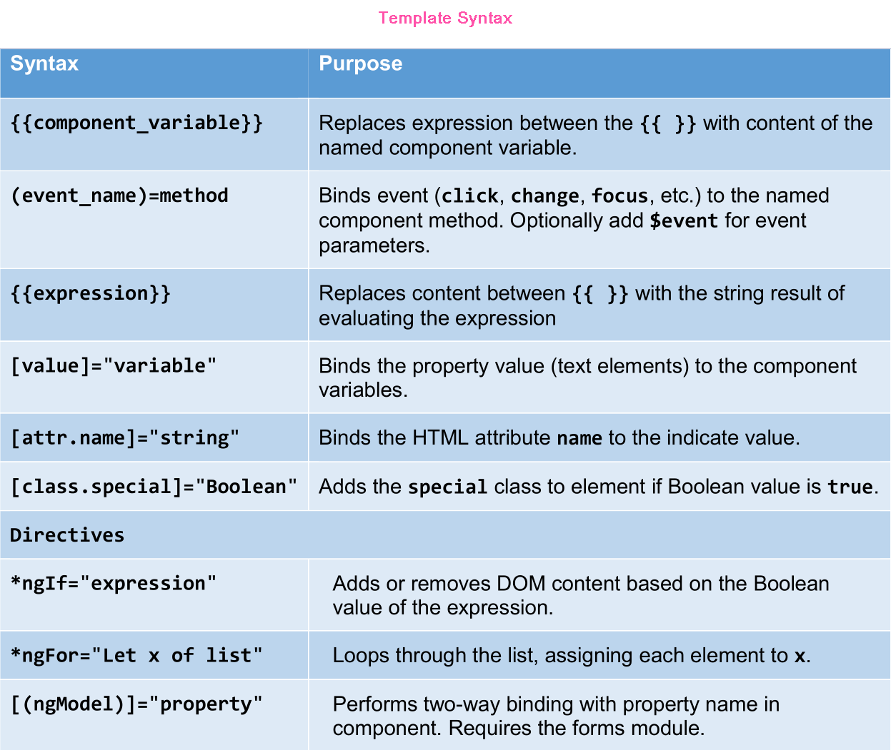
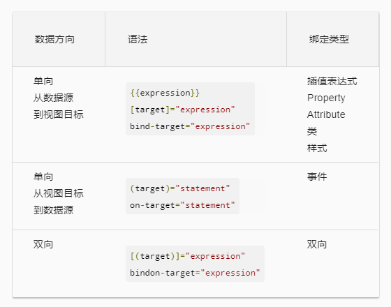
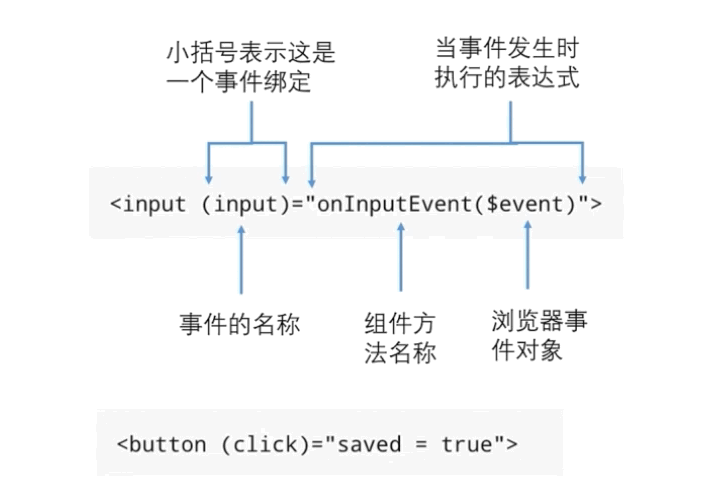
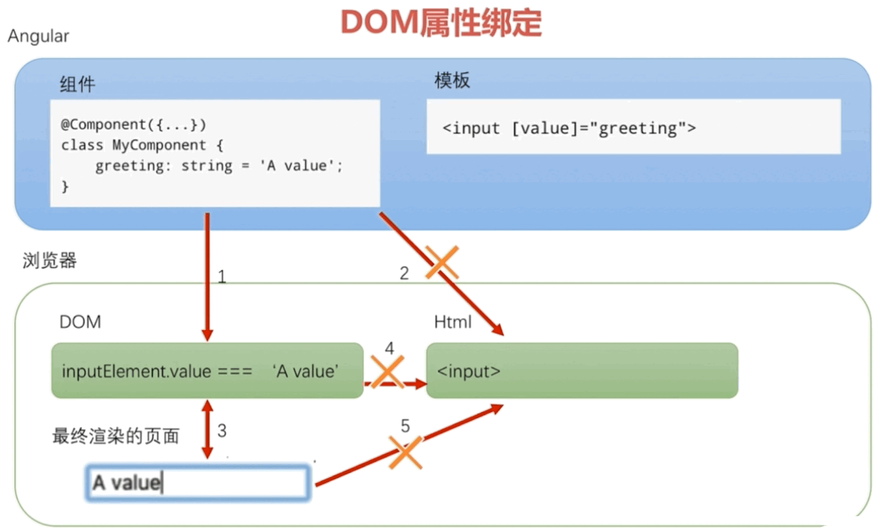
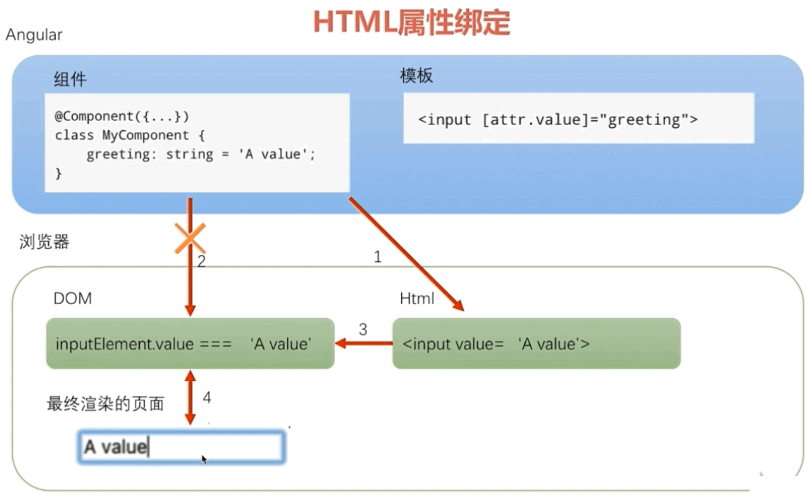
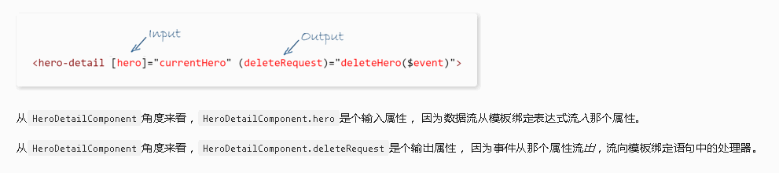

# 模板语法
- 模板语法一栏表

  

- 数据绑定的三种方式

  
  **angular默认数据绑定由双向绑定改为单向绑定**

  + 使用插值表达式将一个表达式的值显示在模板上
  ```typescript
    <h1>{{productTitle}}</h1>
  ```

  + 使用方括号将`HTML`标签的一个属性绑定到一个表达式上
  ```typescript
    
  ```

  + 使用小括号将组件控制器的一个方法绑定为模板上一个事件的处理器
  ```typescript
    <button (click)="toProductDetail()">商品详情</button>
  ```

- 数据绑定目标

  | 绑定类型      | 目标               | 范例                                       |
  | --------- | ---------------- | :--------------------------------------- |
  | Property  | 元素的property      | ``             |
  |           | 组件的property      | `<app-hero-detail [hero]="currentHero"></app-hero-detail>` |
  |           | 指令的 property     | `<div [ngClass]="{'special': isSpecial}"></div>` |
  | 事件        | 元素的事件            | `<button (click)="onSave()">Save</button>` |
  |           | 组件的事件            | `<app-hero-detail (deleteRequest)="deleteHero()"></app-hero-detail>` |
  |           | 指令的事件            | `<div (myClick)="clicked=$event" clickable>click me</div>` |
  | 双向        | 事件与 property     | `<input [(ngModel)]="name">`             |
  | Attribute | attribute（例外情况）  | `<button [attr.aria-label]="help">help</button>` |
  | CSS 类     | `class` property | `<div [class.special]="isSpecial">Special</div>` |
  | 样式        | `style` property | `<button [style.color]="isSpecial ? 'red' : 'green'">`​ |

- 事件绑定
  

  ```typescript
    // bind.component.html
    <button (click)="doOnClick($event)"></button>
    
    // bind.component.ts
    export class BindComponent implements OnInit {
      constructor(){}
      ngOnInit(){}
      doOnClick(event: any) {
        console.log(event);
      }
    } 
  ```

  **说明**:
    - 事件绑定等号左侧被绑定的事件的名称用小括号包裹(被绑定的事件既可以是标准的`DOM`事件，也可以是自定义事件)
    - 右侧为对应的事件处理方法(也可以是直接赋值)。
    - 当该事件被触发时，方法就会被调用。
    - 当处理事件的方法需要了解事件的属性就可以在方法中传入浏览器事件对象`$event`，`$event`的`target`属性指向产生事件的`DOM`节点。

- `DOM`属性绑定

  - 插值表达式和属性绑定是同一个东西

  ```typescript
    
    
  ```

    **说明**: 在渲染视图时，`Angular`会把插值表达式翻译成相应的属性绑定。插值表达式是`DOM`属性绑定。

  -  `HTML`属性与`DOM`属性的区别

    ```typescript
      <button disabled>Click me!</button> // 特殊属性

      <input value="Tom" (input)="doOninput($event)">
      doInput(event:any) {
        console.log(event.target.value); // DOM 属性
        console.log(event.target.getAttribute('value')); // HTML 属性
      }
    ```

    **说明**:

      - 少量的`HTML`属性和`DOM`属性之间有着1:1的映射，如: `id`。

      - 有些`HTML`属性没有对应的`DOM`属性，如: `colspan`。

      - 有些`DOM`属性没有对应的`HTML`属性，如: `textContent`。

      - 就算名称相同，`HTML`属性和`DOM`属性也不是同一样东西。

      - `HTML`属性的值制定了初始值；`DOM`属性的值表示当前值。

      - `DOM`属性的值可以改变；`HTML`属性的值不能改变。

      - 模板绑定是通过`DOM`属性和事件来工作的，而不是`HTML`属性。

  - `DOM`属性绑定的过程
    

- `HTML`属性绑定
  > 当没有对应的`DOM`属性可绑定时，就要使用`HTML`属性绑定
  - 基本的`HTML`属性绑定 

    + `<td [attr.colspan]="tableColspan">snoopyQ</td>`

  - `CSS`类绑定

    + `<div class="show" [class]="fl">后面的类会替换前面所有的类</div>` 

    + `<div class="show" [class.special]="isSpecial">当表达式的值为true时，就添加这个类，单一类好用</div>` 

    + `<div [ngClass]="{show:isShow, fl:isFl}">控制多个类是否显示</div>`

  - 样式绑定

    + `<button [style.color]="isSpecial?'red':'green'"></button>`
    + `<button [style.font-size.em]="isDev ? 3 : 1"></button>`
    + `<div [ngStyle]="{'font-style':this.canSave?'italic':'normal'}"></div>`

  - `HTML`属性绑定的过程
    

- 双向绑定
  ```typescript

    // <input [value]="name" (input)="doOnInput($event)">
    
    <input [(ngModel)]="name">
    {{name}}

    export class BindComponent implements OnInit {
      name: string;
      constructor() {
        setInterval(()=>{
          this.name = "snoopy";
        })
      }
      // doOnInput(event){
      //   this.name = event.target.value
      // }
    }
  ```

  - **说明**:  `ngModel`指令常用于表单处理的双向数据绑定


- 绑定源 & 绑定目标
  + 绑定目标在`=`左侧的部分，源是在`=`右侧的部分。

  + 绑定的目标是绑定符：[]、()或[()]中的属性或事件名，源则是引号(`""`)或插值符号中的部分。

  + 源指令中的每个成员都会自动在绑定中可用，能在模板表达式或语句中访问指令的成员。

  + 访问目标指令中的成员则受到限制。只能绑定到那些显式标记为输入或输出的属性。


- 输入 & 输出属性
  + 目标属性必须被显式的标记为输入或输出。

  + 可以通过装饰器(`@Input()、@Output()`)，或者通过元数据数组`@Component({inputs: ['hero'],outputs: ['deleteRequest'],})`来指定输入、输出属性。

  + 从目标指令的角度来看，输入属性通常接收数据值，而输出属性暴露事件生产者。

  


- 模板表达式操作符
  + 管道操作符(`|`)

    * 在绑定之前，通过管道对表达式的结果进行一些转换。

    * 管道是一些简单的函数，接收一个输入值，并返回转换结果。

    * 通过在模板表达式中使用管道操作符实现。

    * 管道操作符将其左侧的表达式结果传给右侧的管道函数。

    * 可以通过多个管道来串联表达式，同时，还可以对它们使用参数。

  + 安全导航操作符(`?.`)和空属性路径

    * 安全导航操作符用来保护出现在属性路径中`null`和`undefined`值。

    * 表达式会在它遇到第一个空值得时候跳出，显示是空的，但应用正常工作，而没有发生错误。

  + 非空断言操作符(`!`)

    * 在`TypeScript 2.0`中，使用`--strictNullChecks`标志强制开启`严格空值检查`，以确保不存在意料之外的`null`或`undefined`

    * 在严格空值检查模式下，通过使用非空断言操作符(`!`)，避免有类型的变量未赋值而产生的报错。

    ```
    	<div *ngIf="hero">
    	  The hero's name is \{\{hero!.name\}\}
    	</div>
    ```

