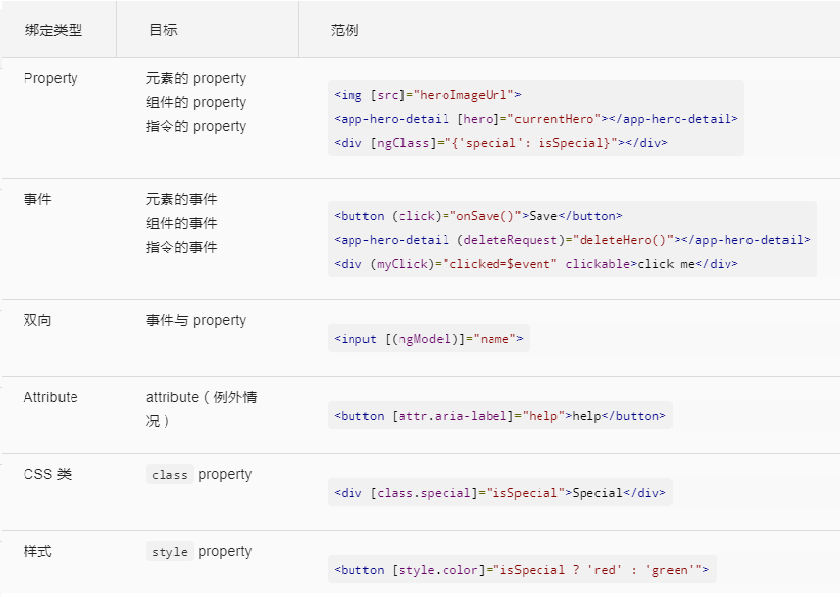

# Template Syntax


- 数据绑定的三种方式

	

- `attribute` & `property`的区别
	+ `attr`是由`HTML`定义的；`prop`是由`DOM`定义的。
	+ `attr`初始化`DOM property`，`attr`值自此不变，而`prop`可变。
	+ 模板绑定是通过`prop`和事件来工作的，而不是`attr`。

- 绑定目标
	
	

- 绑定源 & 绑定目标
	+ 绑定目标在`=`左侧的部分，源是在`=`右侧的部分。
	+ 绑定的目标是绑定符：[]、()或[()]中的属性或事件名，源则是引号(`""`)或插值符号中的部分。
	+ 源指令中的每个成员都会自动在绑定中可用，能在模板表达式或语句中访问指令的成员。
	+ 访问目标指令中的成员则受到限制。只能绑定到那些显式标记为输入或输出的属性。

- 输入 & 输出属性
	+ 目标属性必须被显式的标记为输入或输出。
	+ 可以通过装饰器(`@Input()、@Output()`)，或者通过元数据数组`@Component({inputs: ['hero'],outputs: ['deleteRequest'],})`来指定输入、输出属性。
	+ 从目标指令的角度来看，输入属性通常接收数据值，而输出属性暴露事件生产者。
	


- 模板表达式操作符
	+ 管道操作符(`|`)
		* 在绑定之前，通过管道对表达式的结果进行一些转换。
		* 管道是一些简单的函数，接收一个输入值，并返回转换结果。
		* 通过在模板表达式中使用管道操作符实现。
		* 管道操作符将其左侧的表达式结果传给右侧的管道函数。
		* 可以通过多个管道来串联表达式，同时，还可以对它们使用参数。
	+ 安全导航操作符(`?.`)和空属性路径
		* 安全导航操作符用来保护出现在属性路径中`null`和`undefined`值。
		* 表达式会在它遇到第一个空值得时候跳出，显示是空的，但应用正常工作，而没有发生错误。
		
	+ 非空断言操作符(`!`)
		* 在`TypeScript 2.0`中，使用`--strictNullChecks`标志强制开启`严格空值检查`，以确保不存在意料之外的`null`或`undefined`
		* 在严格空值检查模式下，通过使用非空断言操作符(`!`)，避免有类型的变量未赋值而产生的报错。
		```
			<div *ngIf="hero">
			  The hero's name is \{\{hero!.name\}\}
			</div>
		```
