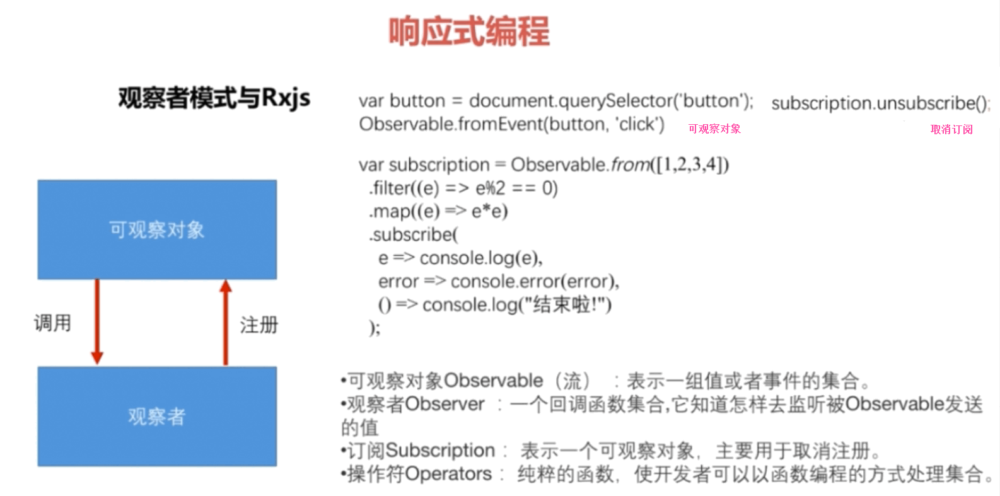

# 响应式编程
- 观察者模式
	
	

- 响应式编程
	
	**响应式编程就是异步数据流编程**
	
	> 响应式编程可以创建所有事物的数据流(如: 变量、单击事件、用户的输入、缓存等)，通过监听这些事物的发生过程，可以做出相应的操作。需要有函数方法可以用来创建流，进行组合、过滤等，以得到想要的东西。
  
  ```typescript
    // 响应式编程
		import {Observable} from "rxjs";  // `rxjs` js响应式编程包
    constructor(){
	  	Observable.from([1, 2, 3, 5, 6])  // 被观察者  可做三件事: 1.发送一个元素， 2.抛出异常， 3.发送一个信号表示结束
	  		.filter( e => e%2 == 00)  // 操作符
	  		.map( e => e*e )
	  		.subscribe(    // 观察者 定义三个方法: 1.处理流中发送的元素， 2.处理流中抛出的异常(可选)， 3.在流结束的时候调用(可选)
					e => console.log(e),  
					err => console.error(err),
					() => conosle.log("finish")
	  		)
	  }
  ```
  
  - 模板本地变量
  
	  ```typescript	
		  //	<input (keyup)="onKey($event)">
		  // onKey(event){
			//	console.log(event.target.value)
			// }

			// 模板本地变量，可以获取html元素的引用，不必使用$event
			<input #myField (keyup)="onKey(myField.value)"> // myField 就代表input标签
	  	onKey(value: string){
				console.log(value)
			}	
	  ```

- 如何使用流处理事件
	
	> 实现: 用户输入股票名称，间隔一定时间，发请求获取相应股票的信息。
	
	```typescript
		// app.module.ts
		import{ FormsModule, ReactiveFormsModule } from '@angular/forms';  
		@NgModule({
			imports: [
				FormsModule,
				ReactiveFormsModule  
			]
		})

		// bind.component.ts
		import { FormControl } from "@angular/forms";
		import 'rxjs/Rx';  // 提供debounceTime()方法
		export class BindComponent implements OnInit {
			searchInput: FormControl = new FormControl();
			constructor(){
				this.searchInput.valueChanges
					.debounceTime(500) // 每个500毫秒接收一次searchInput发送的值
					.subscribe(
						stockCode => this.getStockInfo(stockCode);
					)
			}
			getStockInfo(value: string){
				console.log(value);
			}
		}
		

		// bind.component.html
		<input [formControl] = "searchInput">

	```

 **注意**: `ReactiveFormsModule`是`Angular`中用于响应式编程的模块，提供`FormControl`对象，每个表单元素都有一个`FormContorl`，当表单的值发生变化的时候，`FormControl`就会发送一个`valuechange`事件，这些事件就会组成一个可以订阅的流。


# 响应式表单

> 响应式表单:
> 
> 使用响应式表单时，通过编写`ts`代码而不是`html`代码来创建一个底层的数据模型。
> 
> 在这个模型定义好以后，使用一些特定的指令，将模板上的`html`元素与底层的数据模型连接在一起。

- 响应式表单和模板式表单的不同点

	+ 不管是那种表单，都有一个对应的数据模型来存储表单的数据。在模板式表单中，数据模型是由ng基于组件模板中的指令隐式创建的。而在响应式表单中，通过编码明确的创建数据模型然后将模板上的`html`元素与底层的数据模型连接在一起。

	+ 数据模型是一个由`angular/forms`模块中的一些特定的类，如`FormControl`、`FormGroup`、`FormArray`等组成的。在模板式表单中，是不能直接访问到这些类的。
	
	+ 不管使用哪种表单都需要在根模块中引入相应的模块，模板式表单对应`FormsModule`，响应式表单对应`ReactiveFormsModule`


