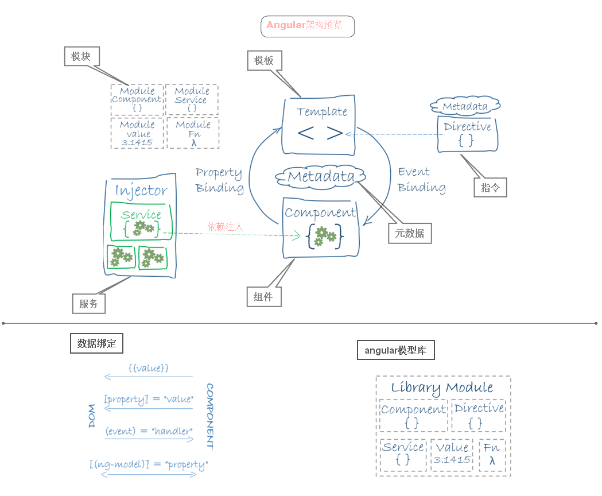
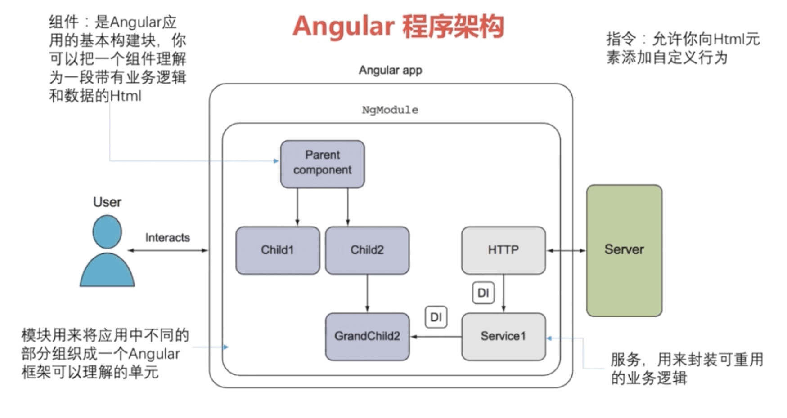

# Introduce
> Angular架构预览 <u>以下`ng`代指`Angular`</u>




## 八大基础知识
  - 组件
    + 组件是一个`Angular`类，用于把数据展示到视图，组件控制着视图，并处理几乎所有的视图显示和交互逻辑。
    + 组件是`Angular`应用的基本构建块，组件其实是一个拥有模板的指令，可将其理解为一段带有业务逻辑和数据的`html`。
    + 需要将`@Component`装饰器应用到一个组件类，在类中为组件定义应用逻辑(属性和方法等)，从而把必要的组件元数据附加到类上。
    + `Angular`会需要元数据来创建一个组件实例，组件通过一些由属性和方法组成的API与视图交互，即把组件的模板作为视图渲染出来。
  - 指令
    + 首先，组件就是一个带模板的指令。`Angular`在渲染模板时，会根据指令提供的操作对`DOM`进行转换。`@Component`装饰器实际上就是一个`@Directive`装饰器，只是扩展了一些面向模板的特性。
    + 其次，指令还有：结构型指令和属性型指令。
    + 结构型指令通过在`DOM`中添加、移除和替换元素来修改布局。
      ```html
        <li *ngFor="let hero of heroes"></li>
        <app-hero-detail *ngIf="selectedHero"></app-hero-detail>
      ```
    + 属性型指令用来修改一个现有元素的外观或行为。
      

    + 最后，还可以编写自定义指令。
  - 服务：服务可以用来封装可重用的业务逻辑。
  - 模块
    + 模块用来将应用中不同的部分组织成一个`Angular`框架可以理解的单元。
    + ng应用的模块化系统中，模块被称为`Angular模块`或者`NgModules`。
    + 每个ng应用都至少有一个模块(根模块-AppModule)
       * 根模块用来引导并运行应用。
       * 最初应用可能就只有一个单一的根模块，等应用复杂，将会拆分到多个"特性"模块中。
       * 特性模块只会在用户访问到这些特性的时候才会加载(即惰性加载)。
    + ng模块都是一个带有`@NgModule`装饰器的类 
      * `declarations` - 声明本模块中拥有的视图类。必须在`@NgModule`类声明每一个组件，否则当使用该组件时会报错。ng 有三种视图类：组件、指令和管道，有且只有上述三者可添加至该数组中。
      * `exports` - `declarations` 的子集，可用于其它模块的组件模板。
      * `imports` - 存放本模块声明的组件模板需要的类所在的其它模块，其放置只能是`NgModule类`。
      * `providers` - 服务的创建者，提供商添加到根模块上，加入到全局列表中，可用于应用的任何部分。
      * `bootstrap` - 指定应用的主视图（称为根组件-AppComponent），它是所有其它视图的宿主。只有根模块才能设置`bootstrap`属性。在启动过程中，其中一步是创建列在`bootstrap`数组的组件， 并将它们每一个都插入到浏览器的DOM中。每个被引导的组件都是它自己的组件树的根。 插入一个被引导的组件通常触发一系列组件的创建并形成组件树。
  - 模板：通过组件自带的模板来定义组件视图(template\templateUrl)。
  - 元数据
  - 数据绑定
  - 依赖注入
    + 依赖注入是提供类的新实例的一种方式，还负责处理好类所需的全部依赖。大多数依赖都是服务。
    + `Angular`使用依赖注入来提供新组件以及组件所需的服务。
    + `Angular`通过查看构造函数的参数类型得知组件需要哪些服务。
    + 注入器 (injector) 是本机制的核心。
      * 当`Angular`创建组件时，会首先为组件所需的服务请求一个注入器(injector)。
      * 注入器负责维护一个容器，用于存放它创建过的服务实例。
      * 注入器能使用提供商创建一个新的服务实例。
    + 提供商是用来创建或返回服务，通常就是这个服务本身，可以在模块或组件中注册提供商，以便在任何地方或者组件层使用。
    + 把提供商注册到注入器。

## 其他特性和服务
  - 动画
  - 变更检测
  - 事件
  - 表单
  - HTTP
  - 生命周期钩子：指令和组件具有生命周期，在与用户交互过程中，指令和组件会被创建、更新和销毁。 通过<b>生命周期钩子</b>在组件生命周期各个时间点上插入操作。
  - 管道：管道是一个函数，用于把输入值转换成输出值以供视图显示。
  - 路由器
  - 测试

## 引导过程
  - 首先，使用即时编译器(JIT)动态编译应用。在`src/main.ts`中引导即时编译的浏览器应用。
  - 然后，动态创建浏览器平台，并引导根模块`AppModule`。
  - 最后，搭建运行环境，从根模块(`AppModule`)的`bootstrap`数组中提出根组件(`AppComponent`)，创建该组件实例，并将其插入到组件`selector`标识的元素标签中，在该标签中显示根组件的实例。