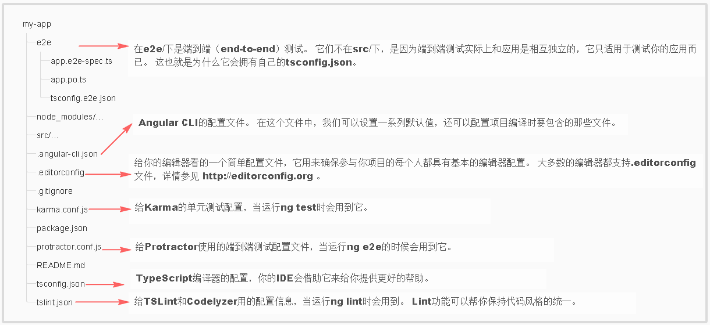
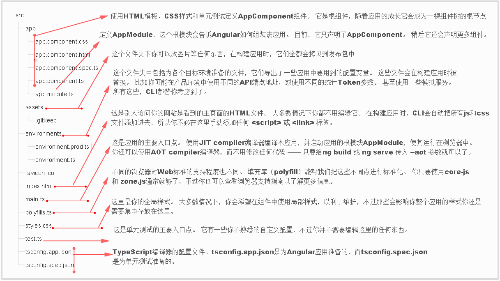

# Quick Start

## 环境配置
  - `TypeScript`: `npm i -g typescript` (>=1.7)

  - `angular-cli`: `npm i -g @angular/cli` (命令行输入`ng`查看是否安装成功)

## 快速启动
  ```
    ng new Project-name
    cd Project-name
    ng serve
    // ng serve --host 0.0.0.0 --port 4201
  ```


  > 生成一个包含[路由模块]的`angular`项目
  ```
    ng new router --routing
  ```

  > 生成一个使用scss预编译的`angular`项目
  ```
    ng new myProject --style=scss
  ```
  
## 生成组件、指令、管道和服务

  ```
    ng generate component my-new-component
    # 使用generate别名
    ng g component my-new-component  

    # 支持相对路径生成组件
    # 在 src/app/feature/ 目录下运行:
    ng g component new-cmp
    # 组件将在 src/app/feature/new-cmp 目录下生成
   
    # 但是如果运行:
    ng g component ../newer-cmp
    # 组件将在 src/app/newer-cmp 目录下生成

    # 如果在 src/app you 目录下运行
    ng g component feature/new-cmp
    # 那么组件将在 src/app/feature/new-cmp 目录下生成

  ```

  

  | 脚手架                                      | 用法                                |
  | ---------------------------------------- | --------------------------------- |
  | [Component](https://github.com/angular/angular-cli/wiki/generate-component) | `ng g component my-new-component` |
  | [Directive](https://github.com/angular/angular-cli/wiki/generate-directive) | `ng g directive my-new-directive` |
  | [Pipe](https://github.com/angular/angular-cli/wiki/generate-pipe) | `ng g pipe my-new-pipe`           |
  | [Service](https://github.com/angular/angular-cli/wiki/generate-service) | `ng g service my-new-service`     |
  | [Class](https://github.com/angular/angular-cli/wiki/generate-class) | `ng g class my-new-class`         |
  | [Guard](https://github.com/angular/angular-cli/wiki/generate-guard) | `ng g guard my-new-guard`         |
  | [Interface](https://github.com/angular/angular-cli/wiki/generate-interface) | `ng g interface my-new-interface` |
  | [Enum](https://github.com/angular/angular-cli/wiki/generate-enum) | `ng g enum my-new-enum`           |
  | [Module](https://github.com/angular/angular-cli/wiki/generate-module) | `ng g module my-module`           |

  > 通过上述指令，angular将自动在app.module.ts模块中添加引用，如果需要添加引用到另一个自定义模块，可以用:

  ```
    # 首先创建一个自定义模块
    ng g module new-module

    # 使用相对路径生成自定义模块下的组件，并自动添加引用
    ng g component new-module/new-component

  ```


## 删除、更新`Angular CLI`

  - 删除`Angular CLI`
  ```
    # 全局删除 `angular-cli`
    npm uninstall -g angular-cli
    # 删除项目中的 `angular-cli`，并更新 `package.json`
    npm uninstall --save-dev angular-cli
  ```

  - 更新`Angular CLI`
  ```
    # 全局模块
    npm uninstall -g @angular/cli
    npm cache clean
    # 如果 npm 版本 >5，为了保证验证缓存数据的有效性和完整性，清理垃圾数据，可以使用`npm cache verify`或者直接使用`npm cache clean --force`
    npm install -g @angular/cli@latest

    # 本地模块
    rm -rf node_modules dists
    npm install --save-dev @angular/cli@latest
    npm install
  ```

## 目录结构

