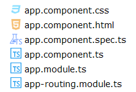
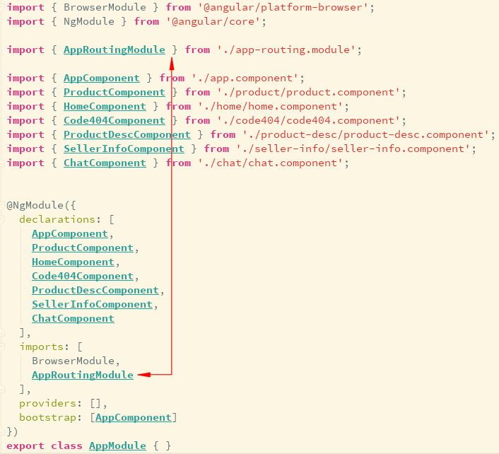

# Routing Navigation

> 路由是`Angular`应用程序的核心，它加载与所请求路由相关联的组件，以及获取特定路由的相关数据。
> 可通过控制不同的路由，获取不同的数据，从而渲染不同的页面。

- 在原有项目的基础上添加路由，需要通过命令`npm i --save @angular/router`安装`angular router`

- 或者直接使用命令`ng new router --routing`生成包含路由模块的项目

  

  > 在根模块`app.modules.ts`中会自动引入路由模块`app-routing.module.ts`，并将`AppRoutingModule`类添加到根模块的`imports`数组中。

  

- 路由的相关对象

  

  - Routes: 路由数组，数组中的每一项都会把一个URL路径映射到一个组件

  - RouteOutlet: 路由出口，通过`<router-outlet></router-outlet>`来指示当前导航到的路由的显示位置。

  - Router: 路由器，为激活的URL显示应用组件。管理从一个组件到另一个组件的导航。如：`{path: 'home', component: HomeComponent}`

  - RouterLink: 路由链接，在模板中添加`routerLink`属性指向某个路由。如：`<a [routerLink]="['/home']">`

  - ActivatedRoute: 激活的路由，为每个路由组件提供一个服务，它包含特定于路由的信息，比如路由参数、静态数据、解析数据、全局查询参数等。

  - RouterLinkActive: 活动路由链接，当`HTML`元素或元素内的`routerLink`变为激活或非激活状态时，该指令为这个`HTML`元素添加或移除`css`类。

  - RouteState: 路由器状态，路由器的当前状态包含了一颗由程序中激活的路由构成的树。它包含一些用于遍历路由树的快捷方法。


- 在`index.html`中定义应用程序的基础路径`<base href="/">`
  > 路由根据这个基础路径来确定应用程序的根目录是`/`

  ```html
  <!doctype html>
  <html lang="en">
  <head>
    <meta charset="utf-8">
    <title>Router</title>
    <!-- 基础路径 -->
    <base href="/">

    <meta name="viewport" content="width=device-width, initial-scale=1">
    <link rel="icon" type="image/x-icon" href="favicon.ico">
  </head>
  <body>
    <app-root></app-root>
  </body>
  </html>
  ```

- `app-routing.module.ts`(路由模块)中配置路由

  ```typescript
  import { NgModule } from '@angular/core';
  import { Routes, RouterModule } from '@angular/router';  // 导入RouterModules和Routes对象

  import { HomeComponent } from './home/home.component';
  import { Code404Component } from './code404/code404.component';

  import { ProductComponent } from './product/product.component';
  import { ProductDescComponent } from './product-desc/product-desc.component';
  import { SellerInfoComponent } from './seller-info/seller-info.component';

  import { ChatComponent } from './chat/chat.component';
  import { LoginGuard } from './guard/login.gurad';
  import { UnsavedGuard } from './guard/unsaved.guard';
  import { ProductResolve } from './guard/product.resolve';
  const routes: Routes = [  // 路由配置
    // 下面都是根路由
    {path: '', redirectTo: '/home', pathMatch: 'full'}, // 重定向路由
    {path: 'chat', component: ChatComponent, outlet: "aux"}, // 辅助路由
    {path: 'home', component: HomeComponent}, // 路由路径为空时，注意不能用'/'开头，为了在多个路由间导航，使用相对路径
    {path: 'product/:id',  // 在路由路径中传递数据 第一步: 修改路由中的path属性，使其可以携带参数
      component: ProductComponent,
      children: [
        // 下面是product的子路由
        {path: '', component: ProductDescComponent},
        {path: 'seller/:id', component: SellerInfoComponent}
      ],
      //canActivate: [LoginGuard],
      // canDeactivate: [UnsavedGuard],
      resolve: {
        product: ProductResolve
      }
    },
    {path: '**', component: Code404Component}
  ];
  @NgModule({
    imports: [RouterModule.forRoot(routes)],  
    exports: [RouterModule],
    providers: [LoginGuard, UnsavedGuard, ProductResolve]
  })
  export class AppRoutingModule { }
  ```

- `product.component.ts`中使用`ActivateRoute`参数快照或参数订阅功能来获取路由中传递的参数
  ```typescript
  import { Component, OnInit } from '@angular/core';
  import { ActivatedRoute, Params } from '@angular/router';   // 导入`ActivatedRoute`
  import { ProductResolve } from '../guard/product.resolve';

  @Component({
    selector: 'app-product',
    templateUrl: './product.component.html',
    styleUrls: ['./product.component.css']
  })
  export class ProductComponent implements OnInit {
    private productId: number;
    private productName: string;
    constructor(private routeInfo: ActivatedRoute) { }  // 在product组件的构造函数中注入`ActivatedRoute`
    ngOnInit() {  // 在组件在创建的时候，只执行一次 ，
      // this.productId = this.routeInfo.snapshot.queryParams["id"]; // 获取查询参数中的数据
      /*参数快照与参数订阅*/
      // this.productId = this.routeInfo.snapshot.params["id"]; 在路由路径中传递数据 第三步：获取路由中传递的数据
      this.routeInfo.params.subscribe((params: Params) => this.productId = params["id"])  // 通过订阅`ActivatedRoute`对象的`params`属性来获取路由参数。
      this.routeInfo.data.subscribe((data: {product: Product}) => {
        this.productId = data.product.id;
        this.productName = data.product.name;
      })
    }
  }

  export class Product {
    constructor(public id: number, public name: string){};
  }
  ```

- `app.component.html`中使用`router-outlet`展示路由
  > 配置完路由信息后，就要使用`router-outlet`的指令告诉`Angular`在哪里加载组件。当`Angular`路由匹配到响应路径，并成功找到需要加载的组件时，将动态创建对应的组件，并将其作为兄弟元素插入到`router-outlet`之后。

  ```typescript
   <div class="handler-wrap">
    <a [routerLink]="['/home']" routerLinkActive="active">home</a>  //路径必须使用‘/’标识导航到根路由 
    <a [routerLink]="['/product']" [queryParams]="{id: 1}" routerLinkActive="active">商品详情</a> // 在查询参数中传递参数
    <a [routerLink]="['/product', 1]" routerLinkActive="active">商品详情</a> //在路由路径中传递数据 第二步： 修改路由链接的参数来传递参数 
    <button type="button" (click)="toProductDetails()">商品详情</button> // 事件绑定 

    <a [routerLink]="[{outlets: {primary: 'home', aux: 'chat'}}]">开始聊天</a>
    <a [routerLink]="[{outlets: {aux: null}}]">结束聊天</a>
  </div>
  <router-outlet></router-outlet>   //用来指示当前导航到的路由的显示位置

  <router-outlet name="aux"></router-outlet> //辅助路由插座
   
  ```

- `app.component.ts`中使用`navigate()`方法

  ```typescript
  import { Component } from '@angular/core';
  import { Router } from "@angular/router";  

  @Component({
    selector: 'app-root',
    templateUrl: './app.component.html',
    styleUrls: ['./app.component.css']
  })
  export class AppComponent {
    title = 'app';

    constructor(private router:Router) {  // 注入router对象
    }

    toProductDetails() {
      this.router.navigate(['/product', 2])  // 调用router对象的`navigate()`方法
    }
  }
  ```

**说明**:

- `RouterModule`对象为我们提供两个静态方法`forRoot()`和`forChild()`来配置路由信息。

  + `RouterModule.forRoot()`方法用于在根模块中定义主要的路由信息，通过调用该方法可以让根模块可以访问路由模块中定义的所有指令。

  + `RouterModule.forChild()`方法用于在子模块(特性模块)中。

- 路由数组(routes)描述如何进行导航。 

  + 把路由数组(routes)传给`RouterModule.forRoot`方法并传给本模块的`imports`数组就可以配置路由器。

- 每个`Route`都会把一个`url`的`path`映射到一个组件。

  + `path`属性定义路由的匹配路径，不能以斜杠(/)开头。路由器会解析和构建最终的`URL`，在视图之间导航时，可以任意使用相对路径和绝对路径。

  + `component`属性用于定义路由匹配时需要加载的组件。

- 动态路由，基于动态路由可以根据不同的参数，渲染不同的页面

  + 路由中的`:id`表示的是一个路由参数，而不是URL中实际的部分。

  + 如何获取动态路由的路由参数

    * 在需要用到动态路由的组件(`product.component.ts`)中，先从 @angular/router 模块中导入 `ActivatedRoute`对象

    * 然后在组件类(`ProductComponent`)的构造函数中注入`ActivatedRoute`对象

    * 最后通过订阅`ActivatedRoute`对象的`params`属性来获取路由参数。

- 子路由

    * 在主路由下`children`参数，配置子路由。

    * 需要在主路由引用的组件模板中添加`router-outlet`指令。

- 路由中的`data`属性用来存放每个具体路由相关的任意信息。该数据可以被任何一个激活路由访问，并能用来保存如：页标题、面包屑及其他静态只读数据，使用`resolve守卫`来获取动态数据。

- 重定向路由，路由中的空路径`''`表示应用的默认路径，当URL为空时会访问那里。这个默认路由会重定向到URL`/home`，并显示`HomeComponent`。

- 路由中的`**`是一个通配符，表示通用路由。当所请求的URL不匹配前面定义的路由表中的任何路径时，路由器就会选择此路由。 这个特性可用于显示“404 - Not Found”页，或自动重定向到其它路由。

- 需要注意路由的定义顺序。路由器使用先匹配者优先的策略来匹配路由，所以，具体路由应该放在通用路由的前面。

- 路由守卫

  + 用`CanActivate`来处理导航到某路由的情况，检查路由的访问权限。

  + 用`CanActivateChild`来处理导航到某子路由的情况，检查子路由的访问权限。

  + 用`CanDeactivate`来处理从当前路由离开的情况，询问是否丢弃为保存的更改。

  + 用`Resolve`在路由激活之前获取路由数据，预先获取路由数据。

  + 用`Canload`来处理异步导航到某特性模块的情况，在加载特性模块之前进行检查。

  + 路由守卫执行顺序:

    * 在分层路由的每个级别上，可以设置多个守卫。

    * 路由器会先按照从最深的子路由从下往上检查的顺序来检查`CanDeactivate()`和`CanActivateChild()`守卫。

    * 然后，在从上到下的顺序检查`CanActivate()`守卫。

    * 如果特性模块是异步加载的，在加载它之前还会检查`Canload()`守卫。

    * 如果任何一个守卫返回`false`，其他尚未完成的守卫会被取消，这样整个导航就被取消了。

- 路由指令

  + `routerLink`: 可以链接到已设置的路由，当链接到动态路由时，需要添加配置额外的路由变量。

  + `routerLinkActive`: 当路由处于激活状态时，使用该指令会向激活的链接添加一个`class`来实现功能。

- 路由API

  + `navigate()`: 在组件类中注入`router`对象，利用其`navigate()`方法(参数和传入routerLink中的一样)，当调用该方法时页面会跳转到对应的路由地址。

  + `navigateByUrl()`: 与`navigate()`类似，都是实现页面导航的。

- 在路由时传递数据的方式

  + 在查询参数中传递数据

  + 在路由路径中传递数据

  + 在路由配置中传递数据


