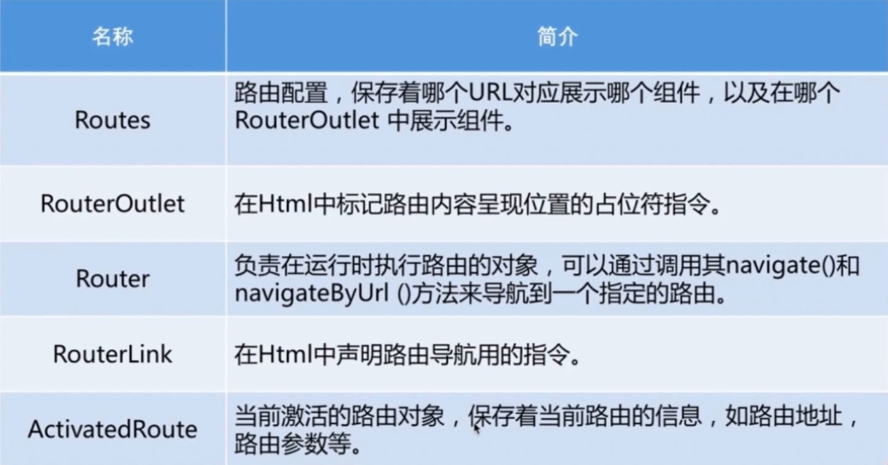

# Routing Navigation

## 路由基础
- 路由的相关对象

  

## 在路由时传递数据的方式
  - 在查询参数中传递数据
  - 在路由路径中传递数据
  - 在路由配置中传递数据

## 重定向路由


## 子路由


## 辅助路由


## 路由守卫
  - 用`CanActivate`来处理导航到某路由的情况。
  - 用`CanActivateChild`来处理导航到某子路由的情况。
  - 用`CanDeactivate`来处理从当前路由离开的情况。
  - 用`Resolve`在路由激活之前获取路由数据。
  - 用`Canload`来处理异步导航到某特性模块的情况。

  在分层路由的每个级别上，可以设置多个守卫。
  路由器会先按照从最深的子路由从下往上检查的顺序来检查`CanDeactivate()`和`CanActivateChild()`守卫。
  然后，在从上到下的顺序检查`CanActivate()`守卫。
  如果特性模块是异步加载的，在加载它之前还会检查Canload()守卫。
  如果任何一个守卫返回`false`，其他尚未完成的守卫会被取消，这样整个导航就被取消了。


```js

// app-routing.module.ts
  import { NgModule } from '@angular/core';
  import { Routes, RouterModule } from '@angular/router';

  import { HomeComponent } from './home/home.component';
  import { ProductComponent } from './product/product.component';
  import { Code404Component } from './code404/code404.component';
 
  // 子路由
  import { ProductDescComponent } from './product-desc/product-desc.component';
  import { SellerInfoComponent } from './seller-info/seller-info.component';
  
  // 辅助路由
  import { ChatComponent } from './chat/chat.component';

  // 路由守卫
  import { LoginGuard } from './guard/login.gurad';
  import { UnsavedGuard } from './guard/unsaved.guard';
  import { ProductResolve } from './guard/product.resolve';

  const routes: Routes = [  // 路由配置
    // 下面都是根路由
    {path: '', redirectTo: '/home', pathMatch: 'full'}, // 重定向路由
    {path: 'chat', component: ChatComponent, outlet: "aux"}, // 辅助路由
    {path: 'home', component: HomeComponent}, // 路由路径为空时，注意不能用'/'开头，为了在多个路由间导航，使用相对路径
    {path: 'product/:id', component: ProductComponent, children: [
      // 下面是product的子路由
      {path: '', component: ProductDescComponent},
      {path: 'seller/:id', component: SellerInfoComponent}
     ], //canActivate: [LoginGuard], canDeactivate: [UnsavedGuard],
       resolve: {
        product: ProductResolve
       } }, // 在路由路径中传递数据 第一步；修改路由中的path属性，使其可以携带参数
    {path: '**', component: Code404Component}  // 通用路由
  ];

  @NgModule({
    imports: [RouterModule.forRoot(routes)],
    exports: [RouterModule],
    providers: [LoginGuard, UnsavedGuard, ProductResolve]
  })
  export class AppRoutingModule { }
```

- 路由数组(routes)描述如何进行导航。 把路由数组(routes)传给`RouterModule.forRoot`方法并传给本模块的`imports`数组就可以配置路由器。
- 每个`Route`都会把一个`url`的`path`映射到一个组件。`path`不能以斜杠(/)开头。路由器会解析和构建最终的`URL`，在视图之间导航时，可以任意使用相对路径和绝对路径。
- 路由中的`:id`是一个路由参数的令牌。
- 路由中的`data`属性用来存放每个具体路由相关的任意信息。该数据可以被任何一个激活路由访问，并能用来保存如：页标题、面包屑及其他静态只读数据，使用`resolve守卫`来获取动态数据。
- 路由中的空路径`''`表示应用的默认路径，当URL为空时会访问那里。这个默认路由会重定向到URL`/home`，并显示`HomeComponent`。
- 路由中的`**`是一个通配符，表示通用路由。当所请求的URL不匹配前面定义的路由表中的任何路径时，路由器就会选择此路由。 这个特性可用于显示“404 - Not Found”页，或自动重定向到其它路由。
- 需要注意路由的定义顺序。路由器使用先匹配者优先的策略来匹配路由，所以，具体路由应该放在通用路由的前面。