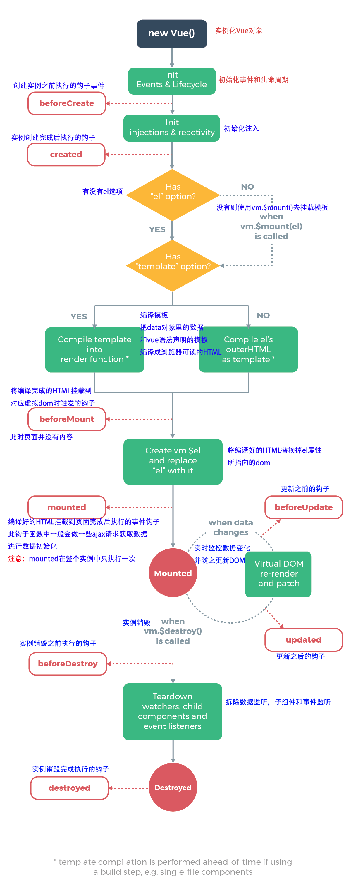

# API
> 常用API简介

## 全局API
- `Vue.use(plugin)`
  + 用于安装vue插件，实际上调用的是`install`里面的组件。
  
  + 如果插件是一个对象，必须提供`install`方法(eg: `VueRouter`)，且需要使用`Vue.use(VueRouter)`；
  
  + 如果插件是一个函数，函数本身被视作`install`方法(eg: `axios`)，就不需要使用`Vue.use(axios)`。
  
  + `install`方法调用时，会将`Vue`作为参数传入；同一个插件多次调用`install`方法，插件只会被安装一次。
  
- `Vue.extend(options)`
  + 可以用来构造`Vue`组件，返回一个扩展实例构造器。

- `Vue.component(id, [definition])`
  + 用于注册或获取全局组件。

  + 注册全局组件时，会使用给定的`id`设置组件的名称。

  ```
    // 使用方法
    Vue.component('snoopy-test', Vue.extend({})) // 注册组件，传入一个扩展过的构造器
    Vue.component('snoopy-test', {}) // 注册组件，传入一个选项对象(自动调用Vue.extend({}))
    Vue.component('snoopy-test') // 获取注册的组件(返回构造器)

    // 示例：注册一个Header组件，并全局引用

    // src/components/commons/Header.vue
    <template>
      // ...
    </template>
    <script>
      export default {
        data() {
          return {}
        },
        props: ['message'],
        methods: {
          goBack(){
            this.$router.go(-1);
          }
        }
      }
    </script>

    // router/index.js
    import Header from '@/components/commons/Header';
    Vue.component('Header', Header) 
  ```

- `Vue.nextTick([callback, context])`
  + [事件循环机制](http://www.cnblogs.com/hity-tt/p/6733062.html)

  + 由于Vue的数据驱动视图更新是异步的，即修改数据，视图不会立即更新，而是等同一事件循环中的所有数据变化完成后，再统一进行视图更新。

  + 在同一事件循环中的数据变化后，DOM完成更新，立即执行`nextTick(callback)`中的回调。
  
  ```
    // 修改数据
    vm.msg = 'snoopy'
    // DOM 还没有更新
    Vue.nextTick(function(){
      // DOM 更新了  
    })

    // 也可作为`Promise`使用
  ```
  
  + 使用场景：
    * 需要在视图更新之后，基于新的视图进行操作，一定要放在`Vue.nextTick()`的回调函数中；
    * 在`created()`钩子函数中进行的DOM操作时，一定要放在`Vue.nextTick()`的回调函数中。
  
## 选项
### 数据
- `props`
  + 用于接收来自父组件的数据。
  
  + `props`是单向绑定的，当父组件的属性变化时，子组件所有`prop`都会更新为最新值，不应该在子组件内部改变`prop`。
  
  + `props`静态传递数据：
    ```html
      // 父组件向组件中传值
      <div id="app">
        <my-component message="hello" name="snoopy" age="18"></my-component>
      </div>
      <script>
        Vue.component('my-component', {
          // 子组件显示声明，使用父组件的数据 message、name、age
          props: ['message', 'name',  'age'],
          // 用data选项对数据进行处理
          data() {
            return {
              message1: this.message + '用data选项对数据进行处理'
            }
          },
          // 用计算属性选项对数据进行处理
          computed: {
            message2(){
              return this.message + '用计算属性对数据进行处理'
            }
          },
          template: `<div>
                        <p>{{message1}}</p>
                        <p>{{message2}}</p>
                        <p>{{message3}}{{name}}我今年{{age}}了</p>
                    </div>`
        })

        new Vue({
          el: '#app'
        })
      </script>
    ```
  
  + `props`动态传递数据
    ```html
      <div id="app">
        <input v-model="parentMsg">
        <my-component :message="parentMsg"></my-component>
      </div>
      <script>
        Vue.component('my-component', {
          props: ['message'],
          data() {
            return {count: this.message + "snoopy-test"}
            // `Prop`作为初始值传入后，子组件想把它当作局部数据来用；
            // 定义一个局部变量，并用prop的值初始化它。
          },
          computed: {
            normalizedSize() {
              return this.message.trim().toLowerCase();
              // `Prop`作为原始数据传入，由子组件处理成其他数据输出；
              // 定义一个计算属性，处理prop的值并返回。
            }
          },
          template: `<div>
                        <p>{{message}}---{{normalizedSize}}</p>   
                        <p>{{count}}</p> 
                    </div>`
        })
        new Vue({
          el: '#app',
          data； {
            parentMsg: 'snoopy-fifi'
          }
        })
      </script>
    ```

  + `props`验证。可以为组件的`props`指定验证规则。开发供他人使用的组件时用。

- `watch`
  > `watch`<b>是一个对象</b>，键是需要观察的表达式(可以是`data`中的变量、对象或数组，甚至是当前组件的`$route`)；值就是观察的表达式发生变化时，要执行的函数(可以是函数、方法名或包含选项的对象)。
  
  + `watch`的值是函数时，这个函数有两个形参，第一形参为被观察的对象之前的值，第二个参数为其现在的值。
  + `watch`的值是方法名时，该方法名需要用单引号包裹。
  + `watch`的值是包括选项的对象时，该选项包括: 
    * `handler`：其值是一个回调函数。即监听到变化时应该执行的函数。
    * `deep`：其值是`true`时，表示深度监听，即对象内部的属性监听。
    * `immediate`：其值是`true`时，该回调将会在监听开始之后被立即调用，即以当前的初始值执行回调。

  ```js
    export default {
      data() {
        return {
          user: {
            phone: '',
            codeMsg: '',
            name: ''
          }
        }
      },

      watch {
        user: {  
          deep: true,
          handler: function(val, oVal) {
            console.log(val.phone);  
          }
        },
        'user.name': function(val, oVal) { // 键路径必须加上引号
          console.log('new': val);
        },

      }
    }
  ```

### 生命周期钩子

- `created`
  + 在实例创建完成后被立即调用。
  + 实例完成以下配置：数据观测、属性和方法运算、watch/event事件回调。
  + 此时挂载阶段还没开始，$el属性目前不可见。
  + 应用场景：可以调用实例的数据和实例方法。带异步数据请求的方法可以放在这里。

- `mounted`
  + `el`被新创建的`vm.$el`替换，并挂载到实例上去之后调用该钩子。
  + `mounted`不会承诺所有的子组件也都一起被挂载。如果希望等到整个视图都渲染完毕，可以用`vm.$nextTick`替换掉`mounted`。
  ```js
    mounted: function(){
      this.$nextTick(function(){
        //
      })
    }
  ```

  + 应用场景：用于初始数据的DOM渲染。需要操作DOM的方法放这里。

- `updated`
  + 数据更改导致虚拟DOM重新渲染和打补丁，在这之后会调用该钩子。
  + 应用场景：用于对数据更新做统一处理。如果想分别区分不同的数据更新，同时进行DOM操作就使用`$nextTick`。

## 特殊特性
- `key`
  + [虚拟DOM的Diff算法](https://www.zhihu.com/question/61064119/answer/183717717)
  + `key`是为了高效的更新虚拟DOM。
  + 在使用相同标签名元素的过渡切换时，为了防止只替换内部属性而不触发过渡效果，也会用到`key`。

  ```html
    // 结合v-for
    <ul>
      <li v-for="item in items" :key="item.id"></li>
    </ul>

    // 触发过渡   强制替换元素、组件而不是重复利用
    <transition>
      <span :key="text">{{text}}</span>
    </transition>
  ```

- `ref`
  + `ref`用来给元素或子组件注册引用信息。引用信息将会注册在父组件的`$refs`对象上。
  + 如果在普通的DOM元素上使用，引用指向的就是DOM元素；如果用在子组件上，引用就指向组件实例。
  + 当`ref`和`v-for`一起使用时，获取到的引用会使一个数组，包含和循环数据源对应的子组件。

  ```html

    <div id="parent">
      <user-profile ref="profile"></user-profile>
    </div>

    <script>
      var parent = new Vue({ el: '#parent' })
      // 访问子组件实例
      var child = parent.$refs.profile
    </script>
  ```

## 实例属性
- `vm.$refs`
  + 用法：`this.$refs.引用信息`
  + 使用场景：一般用于获取DOM元素(或者获取子组件引用)，减少获取DOM节点的消耗。

 
## 实例方法

### 生命周期
- `vm.$nextTick([callback])` 
  + 将回调延迟到下次`DOM`更新循环之后执行。
  + 在修改数据之后立即使用它，然后等待DOM更新。
  + 其类似于全局方法`Vue.nextTick`，但回调中的`this`自动绑定到调用它的实例上。
  
```js
  new Vue({
    methods: {
      example: function() {
        // 修改数据
        this.message = 'changed';
        // DOM 还没有更新
        this.$nextTick(function(){
          // DOM 更新了
          // this绑定的是当前的实例
          this.doSomthingElse()
        })
      }
    }
  })
```


### 事件
- `vm.$on`&`vm.$emit`
  + `vm.$on`用来监听当前实例上的自定义事件。
  + `vm.$emit`用来触发当前实例上的事件。附加参数都会传给监听器回调，即回调函数会接收所有传入事件触发函数的额外参数。
  +  示例：
    * 父组件使用`@select-type="onSelectType"`监听由子组件`vm.$emit`触发的事件，通过`onSelectType()`接受从子组件传递过来的数据，通知父组件数据改变了
    * 子组件通过`$emit`来触发事件，将参数传递出去。

  ```html
    
    // 父组件
    <template>
      <ratingselect @select-type="onSelectType"></ratingselect> 
      // 2. 用在自定义元素组件上时，可以监听子组件(ratingselect)触发的自定义事件(select-type)；
            父组件可以在使用子组件的地方直接用v-on来监听子组件触发的事件。
    </template>
    <script>
      data(){
        return {
          selectType: 0,
        }
      },
      methods:{
        onSelectType (type) { 
          // 回调函数会接收所有传入事件触发函数的额外参数`type`
          this.selectType = type
        }
      }
    </script>

    // 子组件
    <template>
      <div>
        <span @click="select(0, $event)" :class="{'active': selectType===0}"></span> 
        // 1. 用在普通元素上时，只能监听原生DOM事件；
              如果使用内联语句时，可以传入特殊变量$event，在方法中访问原生事件对象。
        <span @click="select(1, $event)" :class="{'active': selectType===1}"></span>
        <span @click="select(2, $event)" :class="{'active': selectType===2}"></span>
      </div>
    </template>
    <script>
      data() {
        return {
          selectType: 0,
        }
      },
      methods: {
        select(type, event) {
          if(event) event.preventDefault();
          this.selectType = type;
          this.$emit('select-type',type); 
          // `$emit`触发当前实例上的自定义事件`select-type`，并传入了额外参数`type`
        }
      }
    </script>
  ```
  

## 指令
  
  