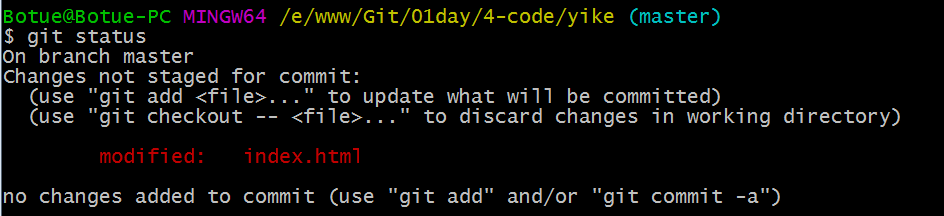

# Git

## Git安装

**Window安装**

[win下git安装](http://git-scm.com/download/win)

 下载Git客户端软件，和普通软件安装方式一样。

**Linux安装**

- CentOS发行版：`sudo yum install git`

- Ubuntu发行版：`sudo apt-get install git`

**Mac安装**

打开Terminal直接输入git命令，会自动提示，按提示引导安装即可。

## Git工作原理

首先，了解Git管理文件的4种状态，分别为<u>未追踪</u>（untracked）、<u>已提交</u>（committed）、<u>已修改</u>（modified）和<u>已暂存</u>（staged），由此引入 Git 项目的3个工作区域的概念：
**Git 仓库**、**工作目录**以及**暂存区域**。

- **Git仓库**目录是Git用来保存项目的元数据和对象数据库的地方。这是Git 中最重要的部分，从其它计算机克隆仓库时，拷贝的就是这里的数据。
- **工作目录**是对项目的某个版本独立提取出来的内容。这些从Git仓库的压缩数据库中提取出来的文件，放在磁盘上供你使用或修改。
- **暂存区域**是一个文件，保存了下次将提交的文件列表信息，一般在Git仓库目录中。有时候也被称作“索引”（Index），不过一般说法还是叫暂存区域。

​

**基本的Git工作流程如下：**

1. 在工作目录中修改文件。
2. 暂存文件，将文件的快照放入暂存区域。
3. 提交文件，找到暂存区域的文件，将快照永久性存储到Git仓库目录。

## Git本地仓库

> Git本地仓库指的是开发者计算机中的仓库。

###  Git基础

> 命令行方式：任意目录（建议开发根目录）右键 > Git Bash Here

**1. 配置用户**

配置用户的意义在于记录开发者信息，以便在版本控制记录开发者的操作行为，如lion于2016-08-24解决了一个bug。

```
git config --global user.name "自已的名字"

git config --global user.email "自已的邮箱地址"

--global 配置当前用户所有仓库
```

**注意**：配置用户只需要执行1次，可以重复使用。

**2. 初始化仓库**

想要利用git进行版本控制，需要将现有项目初始化为一个仓库，或者将一个已有的使用git进行版本控制的仓库克隆到本地。

```
git init
```

`git init`会在当前项目目录中创建一个名为`.git`的隐藏目录，这个目录包含了暂存区和仓库两个区域，有了这个隐藏目录就可以使用git来管理项目了，通过`ls  -al `可以查看。

**3. 查看文件状态**

初始化仓库后便可以进行开发了，进入到刚刚创建好并初始为仓库的目录，添加我们开发需要的文件。

通过`git status`可以检测当前仓库文件的状态（未追踪untracked）。

**注意**：git会忽略空的目录

**4. 添加文件到暂存区**

假设经过一段时间的开发后，需要把已开发的部分暂存起来等待提交，使用`git add `添加到<u>暂存区</u>。

`git add 文件名 / 文件路径 “*”或-A代表所有`

通过`git status`再次查看文件状态，放到暂存区的文件被标记成了<u>绿色</u>，等待提交。

**注意**：颜色是工具给添加的，目的是增加可读性并不是git统一的。

**5. 撤销更改**

继续我们的开发，再次`git status`可以再次查看仓库状态

 

被标记了红色，说明`index.html`被<u>再次修改</u>了。

又经过一段时间后发现新开发的部分有Bug，想要回到之前状态，可以使用`git checkout 文件名`，将上次暂存的文件还原到工作区。

 

**5. 提交文件**

经过一个相对较长阶段开发或者一个功能开发完成了，就可以提交到<u>本地仓库</u>了，永久保存了。

`git commit -m '备注信息'`

将暂存区被标记成绿色的文件，全部提交到本地仓库存储；这时`git status`查看状态,没有什么可提交的，变的很干净。

**6. 查看提交历史**

反反复复开发了很多的功能了，通过`git log`查看一下提交的历史；我们可以查看到一次次的提交记录。

**7. 再次检测仓库文件状态**

隔了好些天后，继续开发， `git status` 查看状态；又提示有修改，等待重新添加到暂存区。

**8. 重新添加暂存区然后提交**

**9. 再次查看历史**

`git log `可查到所有提交历史；这时可以查看到更多提交历史。

**10. 恢复上以前提交的版本**

通过`commit id值`可以回到之前某一次的提交（时光倒流）

`git reset --hard c888a614e072e2` 这样便回到了之前的状态

`git log`再次查看发现最后一次提交成了之前的状态了

 

仓库示意图


###  Git分支

**场景**：在我们的现实开发中，需求往往是五花八门的，同时开发个需求的情况十分常见，比如当你正在专注开发一个功能时，突然有一个紧急的BUG需要你来修复，这个时候我们当然是希望在能够保存当前任务进度，再去修改这个BUG，等这个BUG修复完成后再继续我们的任务。如何实现呢？

**解决方案**：Git通过创建分支来解决实际开发中类似的问题。

在Git的使用过程中一次提交称为<u>历史记录（版本）</u>，并且会生成一个唯一的字符串，如下图：


这个串可以代表某一个历史版本（实际使用只取前面几位就可以），值得注意的是所有的提交（commit）实际上都是在分支（branch）的基础上进行的（只是前面并没有介绍）。

如下图所示：


当我们在初始化仓库的时候（实际上是产生第1次提交时），Git会默认帮我们创建了一个`master`的分支，并且有指针（HEAD）指到了末端。

指针（HEAD）用来标明当前处于哪个分支的哪个版本，如上图指的处于master分支的最后1个版本。

**下面创建自已的分支**：

**1.  创建分支**

`git branch 分支名称`

当接到一个新任务时，先创建一个分支，例如购物车功能`git branch cart`

新分支会在当前分支原有历史版本的结点上进行创建，我们称其为子分支，

如下图

 

**注意**：新建的子分支会继承父分支的所有提交历史。

**2. 切换分支**

`git checkout cart(分支名称)`

上一步只是创建了一个新的分支cart，要开发购物车功能需要切换到cart分支，如下图

 

这时HEAD会指向cart的末端，然后再进行功能开发。

**3. 提交操作**

持续开发购物车功能，这次的提交历史版本就会记录在cart这个分支上了，并且HEAD伴随cart在移动。


**4. 修复Bug**

开发购物车过程中突然需要紧急修复一个`bug`，这时可以另外建立一个分支来进行修复，先切换到`master`分支，`git checkout master` ；


当我们切换回`master`后，HEAD指向了`master`分支的末端，并且我们观察发现我们工作目录中并没有购物车功能代码。

**5. 创建新分支修复 bug**

修改并提交会在`hotfix`分支上创建新版本，并不会影响到`cart`分支的代码。


**6. 继续之前的开发**

修复完bug后切换回`cart`分支，继续开发购物车功能。


**注意**：当我们`git checkout branchname`时，HEAD会自动指向对应分支的末端，工作目录中的源码也会随之发生改变。

这个时候我们就在`hotfix`这个分支上修复了这个BUG，而我们原来在cart分支上的操作并未受到影响。

思考一个问题：

现在cart这个分支上是否包含了hotfix的修复呢？

实际上从上图可以看出这时的cart分支并没有包含有hotfix的修复。

**7. 合并（融合）分支**

 

这时cart会有两个父结点了，`cart`便包含了`hotfix`里的修复了。

**8. 删除分支**

`git branch -d hotfix`

这时用来修复bug创建的`hotfix`分支已经没有用处了，我们可以将它删除。

 

### Git远程（共享）仓库

**场景**：通过上面学习我们可以很好的管理本地版本控制了，可是如果我们下班回到家里突然来了灵感觉得有部分代码可以优化，如果能接着公司电脑上的代码继续写该有多好呀！另一种情形，假设项目比较大，不同的功能模块由不同的开发人员完成，不同模块儿之间又难免会依赖关系，这时如果我们的代码互相合并（融合）该有多好呀！所有模块开发完毕后，需要整合到一起，要能做到准确无误该有多好呀！

**解决方案**：借助一个远程仓库，大家可以共享代码、历史版本等数据，便可以解决以上遇到的所有问题，在学习远程仓库前我们先来学习`git clone path`这个命令。

**3. 创建共享仓库**

Git 要求共享仓库是一个以`.git`结尾的目录。

- `mkdir repo.git` 创建以`.git`结尾目录
- `cd repo.git `进入这个目录
- `git init --bare` 初始化一个<u>共享仓库</u>，也叫裸仓库 注意选项`--bare`

这样我们就建好了一个共享的仓库，但这时这个仓库是一个空的仓库，并且不允在这个仓库中进行任何修改。

**4. 向共享仓库共享（同步）内容**

> 将自已开发的项目同步到这个目录中，其它开发者就可以共享你开发的项目了。

1. 进入到`yike`目录
2. `git push ../repo.git master` 

这样便把`yike`中的项目同步进了`repo.git`中。

**5. 从共享仓库里取出内容**

1. 新创建一个目录（模拟另一个开发者）
2. `git clone ./repo.git demo`

通过`repo.git`共享仓库，我们轻松得到了一个`yike`的副本

**6. 通过demo仓库向repo.git共享内容**

进入到`demo`里，我们做一些修改

`cd demo`

`git push ../repo.git master`

 

**7.在360仓库从repo.git获取共享的内容**

`cd yike`

`git pull ../repo.git master`

奇迹似乎发生了，我们轻松的将demo仓库里的内容，通过`repo.git`共享给了`yike`仓库。

惊喜不断，问题也总是不断，我们发现我们这个共享的仓库只是放到了本地的，其它人是没有办法从我们这个共享仓库共享内容的！！！

然而现实是，办法总是有的！！！！

我们把这个共享的仓库放到一台远程服务器上，问题不就解决了吗？

### gitHub和gitLab

如果我们熟悉服务器的话，我们完全可以将上述的步骤在我们的远程服务器上进行操作，然后再做一些登录权限的设置，就可非常完美的搭建一个共享服务器了。其实为了更好的管理我们的仓库，一些第三方机构开发出了Web版仓库管理程序，通过Web界面形式管理仓库。

**1. 注册账号并完善资料**

> 自行注册略过

**2. 创建共享仓库**

**3. 填写仓库资料**

**4. 共享仓库**

远程地址特别长，我们可以给他起一个别名

`git remote add origin git@github.com:Botue/repo.git`

> 这样origin就代表` git@github.com:Botue/repo.git`

当我们通过`git clone `从共享仓库获内容时，会自动帮我们添加`origin`到对应的仓库地址，例如：`git clone git@github.com:Snoopyofifi/repo.git `会自动添加`origin` 对应`git@github.com:SnoopyoFifi/repo.git`

**5. 生成密钥**

`ssh-keygen -t rsa `然后一路回车，这里会在当前用户生成了一个`.ssh`的文件夹


将`id_rsa.pub`公钥的内容复制

打开gitHub的个人中心

 

打到SSHkeys

 

到此我们便可以通过gitHub 提供的Web界面来管理我们的仓库了。

我们发现通过gitHub管理仓库实在是太方便了，可是只能免费使用公开仓库，自已公司的代码当然不能公开了，可是私有仓库又是需要交“保护费”的，无耐国人还是比较喜欢免费的，网络界总是有很多雷峰的，比如gitLab!!!

gitLab也是一个可以通过Web界面管理仓库的网站程序，我们可以把它架设到公司自已的服务器上，实现仓库私有化，这也是大部分公司通常采用的方法，其使用方法与gitHub十分相似。

我将闲置电脑配置成了一台服务器，上面架设了gitLab程序，我们接下来的练习全部会在gitLab上进行演示。

省略很多内容.....

###  命令汇总

- git config配置本地仓库

> 常用git config --global user.name、git config --global user.email

- git config--list查看配置详情
- git init 初始一个仓库，添加--bare可以初始化一个共享（裸）仓库
- git status 可以查看当前仓库的状态
- git add“文件” 将工作区中的文件添加到暂存区中，其中file可是一个单独的文件，也可以是一个目录、“*”、-A
- git commit -m '备注信息' 将暂存区的文件，提交到本地仓库
- git log 可以查看本地仓库的提交历史
- git branch查看分支
- git branch“分支名称” 创建一个新的分支
- git checkout“分支名称” 切换分支
- git checkout -bdeeveloper 他健并切到developer分支
- git merge“分支名称” 合并分支
- git branch -d “分支名称” 删除分支
- git clone “仓库地址”获取已有仓库的副本
- git push origin “本地分支名称:远程分支名称”将本地分支推送至远程仓库，
- git push origin hotfix（通常的写法）相当于git push origin hotfix:hotfix
- git push originhotfix:newfeature

> 本地仓库分支名称和远程仓库分支名称一样的情况下可以简写成一个，即git push “仓库地址” “分支名称”，如果远程仓库没有对应分支，将会自动创建

- git remote add “主机名称” “远程仓库地址”添加远程主机，即给远程主机起个别名，方便使用
- git remote 可以查看已添加的远程主机
- git remote show “主机名称”可以查看远程主机的信息

### GitLab完整演示

没错，Git非常强大！

但是，如果我们的分支不加以规范管理，也有可能适得其反！

1. 不要有太多的树杈（子分支）
2. 要有一个“稳定分支”，即master分支不要轻意被修改
3. 要有一个开发分支（developer），保证master分支的稳定性
4. 所有的功能分支（feature）从developer创建
5. 所有功能开发完成后新建发布分支（release）

 

 


 

 

### 冲突解决

假如两个开发同时改到同一文件的同一段内容会发生什么事情呢？

这时就会就会产生冲突了，当冲突产生后，需要开发者进行协商确认冲突的原因，然后将冲突代码删除重新提交就可以了。

### Git高级

熟悉掌握以上操作，基本上是可以满足日常开的需要的，但是在解决一些特殊问题时，就又需要我们能够掌握更多的命令。

### gitignore忽略文件

在项目根目录下创建一个`.gitignore`文件，可以将不希望提交的罗列在这个文件里，如项目的配置文件`node_modules`等

https://github.com/github/gitignore

###  比较差异

1. 当内容被修改，我们无法确定修改哪些内容时，可以通过git diff来进行差异比较。

- git difftool 比较的是工作区和暂存的差异
- git difftool “SHA”比较与特定提交的差异
- git difftool “SHA”“SHA”比较某两次提交的差异
- git difftool 分支名称 比较与某个分支的差异

**2. 回滚（撤销）操作**

 

HEAD 默认指向当前分支的“末端”，即最后的一次提交，但是我们通过`git reset` 可以改变HEAD的指向。

**看情况解释（稍微复杂一些，理解就好）**

`git reset`

--hard 工作区会变、历史(HEAD)会变， 暂存区也变

--soft 只会变历史(HEAD)

--mixed（默认是这个选项）历史(HEAD)会变、暂存区也变，工作区不变

`git checkout`

`git checkout SHA-- "某个文件"`，代表只是从SHA这个版中取出特定的文件，和`git reset `是有区别的，reset重写了历史，checkout 则没有。

###  更新仓库

> 在项目开发过程中，经常性的会遇到远程（共享）仓库和本地仓库不一致，我们可以通过git fetch 命令来更新本地仓库，使本地仓库和远程（共享）仓库保持一致。

`git fetch  “远程主机”`

或者

`git fetch “远程主机” “分支名称”`

> 我们要注意的是，利用git fetch 获取的更新会保存在本地仓库中，但是并没有体现到我们的工作目录中，需要我们再次利用git merge来将对应的分支合并（融合）到特定分支。如下

`git pull origin 某个分支`， 上操作相当于下面两步

`git fetch `

`git merge origin/某个分支`

**问题：如何查看远程主机上总共有多少个分支？**

`git branch -a` 便可以查看所有(本地+远程仓库)分支了


###  其他

删除远程分支：`git push origin --delete 分支名称`
