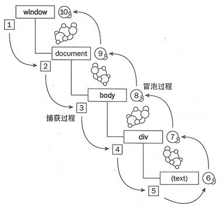

# CodeSnippet

##  判断字符串长度

> 英文占1个字符，中文汉字占2个字符

```js
function strlen(str){
  var len = 0;
  for (var i=0; i<str.length; i++) {
    var c = str.charCodeAt(i);
    if ((c >= 0x0001 && c <= 0x007e) || (0xff60<=c && c<=0xff9f)) {
      len++;
    }
    else {
      len+=2;
    }
  }
  return len;
}
```


##  阻止事件冒泡和浏览器的默认行为

1. 事件冒泡&事件捕获


2. 阻止事件冒泡，使成为捕获事件触发机制
```js
function stopBubble(e) {
  // 如果提供了事件对象，则是一个非IE浏览器
    if (e && e.stopPropagation) {
      // 因此它支持w3c的stopPropagation()方法
    e.stopPropagation();
    } else {
        // 否则，使用IE的方式
    window.event.canceBubble = true;
    }
}
```

3. a链接点击后阻止其跳转，即阻止了事件默认行为
```js
function stopDefault(e) {
  // 如果提供了事件对象，则是一个非IE浏览器
  if(e && e.preventDefault) {
        e.preventDefault();
  } else {
        wondow.event.returnValue = false;
  }
  return false;
}
```

## 绑定事件兼容性封装 

```js
window.onload = function(){
  var EventUtil = {
    // 绑定事件
    addHandler: function(element, type, handler){
      // 若浏览器支持 `addEventListener`， 则使用 `addEventListener` 来添加事件
      if(element.addEventListener){
        element.addEventListener(type, hanlder, false);
      } else if (element.attachEvent) {
      // 否则使用 `attachEvent` ，事件类型前需加 `on`
        element.attachEvent('on' + type, handler);
      } else {
        // 若以上两种添加事件的方法都不支持，则使用默认的行为来添加事件
        element['on' + type] = handler;
      }
    }
    // 移除事件
    removeHandler: function(element, type, handler) {
      if (element.removeEventListener) {
        element.removeEventListener(type, handler, false);
      } else if(element.detachEvent) {
        element.detachEvent('on' + type, handler);
      } else {
        element['on' + type] = null;
      }
    }
  }
}

// 事件绑定函数的调用
EventUtil.addHandler(需要绑定事件的标签, "需要绑定的事件", "绑定事件的处理方法");

EventUtil.removeHandler(需要删除事件的标签, "需要删除的事件", "绑定事件的处理方法");

```

## 事件委托

> 事件委托就是利用冒泡原理，把事件绑定到父元素或祖先元素上，触发执行效果

**场景一**：
> 提高js性能,事件委托可以显著提高事件的处理速度，减少内存占用

```html

  <ul id="list">
    <li id="item1" >item1</li>
    <li id="item2" >item2</li>
    <li id="item3" >item3</li>
  </ul>
  <script>

    var item1 = document.getElementById("item1");
    var item2 = document.getElementById("item2");
    var item3 = document.getElementById("item3");
    document.addEventListener("click",function(event){
      var target = event.target;
      if(target == item1){
        alert("hello item1");
      }else if(target == item2){
        alert("hello item2");
      }else if(target == item3){
        alert("hello item3");
      }
    })

  </script>

```

**场景二**：
> 动态添加的`DOM`元素，不需要因为元素的改动而修改事件绑定

```html

  <ul id="list">
    <li id="item1" >item1</li>
    <li id="item2" >item2</li>
    <li id="item3" >item3</li>
  </ul>
  <script>

    var list = document.getElementById("list");
    document.addEventListener("click",function(event){
      var target = event.target;
      if(target.nodeName == "LI"){
        alert(target.innerHTML);
      }
    })
    var node=document.createElement("li");
    var textnode=document.createTextNode("item4");
    node.appendChild(textnode);
    list.appendChild(node);
    // 当点击item4时，item4有事件响应。说明事件委托可以为新添加的DOM元素动态的添加事件。
  
  </script>

```


## 常用表单验证正则表达式

[正则表达式说明](http://caibaojian.com/javascript-zhengze.html)

> 用户名正则

```js
//用户名正则，4到16位（字母，数字，下划线，减号）
var uPattern = /^[a-zA-Z0-9_-]{4,16}$/;
//输出 true
console.log(uPattern.test("caibaojian"));

```

> 密码强度正则

```js
//密码强度正则，最少6位，包括至少1个大写字母，1个小写字母，1个数字，1个特殊字符
var pPattern = /^.*(?=.{6,})(?=.*\d)(?=.*[A-Z])(?=.*[a-z])(?=.*[!@#$%^&*? ]).*$/;
//输出 true
console.log("=="+pPattern.test("caibaojian#"));

```

> 整数正则

```js
//正整数正则
var posPattern = /^\d+$/;
//负整数正则
var negPattern = /^-\d+$/;
//整数正则
var intPattern = /^-?\d+$/;
//输出 true
console.log(posPattern.test("42"));
//输出 true
console.log(negPattern.test("-42"));
//输出 true
console.log(intPattern.test("-42"));

```

> 数字正则

可以是整数也可以是浮点数

```js
//正数正则
var posPattern = /^\d*\.?\d+$/;
//负数正则
var negPattern = /^-\d*\.?\d+$/;
//数字正则
var numPattern = /^-?\d*\.?\d+$/;
console.log(posPattern.test("42.2"));
console.log(negPattern.test("-42.2"));
console.log(numPattern.test("-42.2"));

```

> Email正则

```js
//Email正则
var ePattern = /^([A-Za-z0-9_\-\.])+\@([A-Za-z0-9_\-\.])+\.([A-Za-z]{2,4})$/;
//输出 true
console.log(ePattern.test("99154507@qq.com"));

```

> 手机号码正则

```js
//手机号正则
var mPattern = /^1[34578]\d{9}$/; //http://caibaojian.com/regexp-example.html
//输出 true
console.log(mPattern.test("15507621888"));

```

> 手机，邮箱验证正则式


```js
  //手机，邮箱验证正则式
  var reMobileEmail = /^(1[34578]\d{9}|[a-zA-Z0-9_\.\-]+@(([a-zA-Z0-9])+\.)+([a-zA-Z0-9]{2,4}))$/;

```

> 身份证号正则

```js
//身份证号（18位）正则
var cP = /^[1-9]\d{5}(18|19|([23]\d))\d{2}((0[1-9])|(10|11|12))(([0-2][1-9])|10|20|30|31)\d{3}[0-9Xx]$/;
//输出 true
console.log(cP.test("11010519880605371X"));

```

>  URL正则

```js
//URL正则
var urlP= /^((https?|ftp|file):\/\/)?([\da-z\.-]+)\.([a-z\.]{2,6})([\/\w \.-]*)*\/?$/;
//输出 true
console.log(urlP.test("http://caibaojian.com"));

```

> IPv4地址正则

```js
//ipv4地址正则
var ipP = /^(?:(?:25[0-5]|2[0-4][0-9]|[01]?[0-9][0-9]?)\.){3}(?:25[0-5]|2[0-4][0-9]|[01]?[0-9][0-9]?)$/;
//输出 true
console.log(ipP.test("115.28.47.26"));

```

> 十六进制颜色正则

```js
//RGB Hex颜色正则
var cPattern = /^#?([a-fA-F0-9]{6}|[a-fA-F0-9]{3})$/;
//输出 true
console.log(cPattern.test("#b8b8b8"));

```

> 日期正则 

```js
//日期正则，简单判定,未做月份及日期的判定
var dP1 = /^\d{4}(\-)\d{1,2}\1\d{1,2}$/;
//输出 true
console.log(dP1.test("2017-05-11"));
//输出 true
console.log(dP1.test("2017-15-11"));

//日期正则，复杂判定
var dP2 = /^(?:(?!0000)[0-9]{4}-(?:(?:0[1-9]|1[0-2])-(?:0[1-9]|1[0-9]|2[0-8])|(?:0[13-9]|1[0-2])-(?:29|30)|(?:0[13578]|1[02])-31)|(?:[0-9]{2}(?:0[48]|[2468][048]|[13579][26])|(?:0[48]|[2468][048]|[13579][26])00)-02-29)$/;
//输出 true
console.log(dP2.test("2017-02-11"));
//输出 false
console.log(dP2.test("2017-15-11"));
//输出 false
console.log(dP2.test("2017-02-29"));

```

> QQ号码正则 

```js
//QQ号正则，5至11位
var qqPattern = /^[1-9][0-9]{4,10}$/;
//输出 true
console.log(qqPattern.test("65974040"));

```

> 微信号正则

```js
//微信号正则，6至20位，以字母开头，字母，数字，减号，下划线
var wxPattern = /^[a-zA-Z]([-_a-zA-Z0-9]{5,19})+$/;
//输出 true
console.log(wxPattern.test("caibaojian_com"));

```

> 车牌号正则

```js
//车牌号正则
var cPattern = /^[京津沪渝冀豫云辽黑湘皖鲁新苏浙赣鄂桂甘晋蒙陕吉闽贵粤青藏川宁琼使领A-Z]{1}[A-Z]{1}[A-Z0-9]{4}[A-Z0-9挂学警港澳]{1}$/;
//输出 true
console.log(cPattern.test("粤B39006"));

```

> 包含中文正则

```js
//包含中文正则
var cnPattern = /[\u4E00-\u9FA5]/;
//输出 true
console.log(cnPattern.test("蔡宝坚"));
```


## placeholder 显示隐藏

```js

  //  控制 `placeholder` 显示隐藏
  function showplacehodler() {
      var arrplace = {
          "#searching": "请输入关键字",
          "#email": "请输入邮箱",
          "#password": "请输入密码",
      };

      function placeholder(id) {
          $(id).focus(function () {
              if (!!!$(this).prop("readonly")) {
                  $(this).prop("placeholder", "")
              }
          });
          $(id).blur(function () {
              $(this).prop("placeholder", arrplace[id])
          });
      }

      for (var k in arrplace) {
          placeholder(k);
      }
  }

  showplacehodler();
  
```

## 表单验证 

```html

  <form>
    <div class="item">
      <label for="">手机号：</label>
      <input type="text" id="phone">
      <span class="spa spa1"></span>
    </div>
    <div class="item">
      <button id="submit">提交</button>
    </div>
  </form>

  <script>

    // 表单验证提交
    // 让第一个表单获取焦点 并 显示提示信息
    $("#phone").focus();
    $(".spa1").text('请您输入11位手机号码').css("color", "#aaa");

    // 失焦判断
    $("input").blur(function () {
        $(".spa").css("color", "#BD362F");
        var ph = /^1[3|5|7|8|][0-9]{9}$/;
        if ($(this).is("#phone")) {//  手机号
            if ($("#phone").val() != "") {
                if (!(ph.test($("#phone").val()))) {
                    $(".spa1").text("请输入正确的手机号");
                    $(this).css("border", "1px solid #BD362F");
                    return false;
                } else if (ph) {
                    $(".spa1").text("");
                    return true;
                }
            } else {
                $(".spa1").text("手机号不能为空");
            }
        }
        if ($(this).is("#password")) { //密码
            var mm = /^[0-9A-Za-z]{6,16}$/;
            if ($("#password").val() != "") {
                if (!(mm.test($("#password").val()))) {
                    $(".spa2").text("请输入由字母数字组成的大于6位的密码");
                    $(this).css("border", "1px solid #BD362F");
                    return false;
                } else {
                    $(".spa2").text("");
                    return true;
                }
            } else {
                $(".spa2").text("密码不能为空");
            }
        }
        if ($(this).is("#confirmpwd")) { //密码
            //var mm = /^[0-9A-Za-z]{6,16}$/
            if ($("#confirmpwd").val() != "") {
                if ($("#confirmpwd").val() != $("#password").val()) {
                    $(".spa3").text("您两次输入的密码不一致");
                    $(this).css("border", "1px solid #BD362F");
                    return false;
                } else {
                    $(".spa3").text("");
                    return true;
                }
            } else {
                $(".spa3").text("");
            }
        }
        if ($(this).is("#nickname")) { //昵称
            if ($("#nickname").val() != "") {
                $(".spa4").text("");
                return true;
            }
            else {
                $(".spa4").text("昵称不能为空");
            }
        }
    });

    // 聚焦提示
    $("input").focus(function () {
        if ($(this).is("#phone")) {
            $(".spa1").text('请您输入11位手机号码').css("color", "#aaa");
            $(this).css("border", "1px solid #aaa")
        }
        if ($(this).is("#password")) {
            $(".spa2").text("请您输入大于6位的密码").css("color", "#aaa");
            $(this).css("border", "1px solid #aaa")
        }
        if ($(this).is("#confirmpwd")) {
            $(".spa3").text("请您再次确认密码").css("color", "#aaa");
            $(this).css("border", "1px solid #aaa")
        }
        if ($(this).is("#nickname")) {
            $(".spa4").text("请您输入昵称").css("color", "#aaa");
            $(this).css("border", "1px solid #aaa")
        }
    });

    // 提交验证
    $("#submit").click(function () {
        var mm = /^[0-9A-Za-z]{6,16}$/;
        var ph = /^1[3|5|7|8|][0-9]{9}$/;
        if (ph.test($("#phone").val()) 
          && mm.test($("#password").val()) 
          && ($("#password").val() == $("#confirmpwd").val())) {
          // 验证成功代码
          return true;
        } else {
            if ($("#modelname").val() == "") {
                $(".spa1").text('请您输入手机号码');
            }
            if ($("#password").val() == "") {
                $(".spa2").text('请您输入密码');
            }
            if ($("#confirmpwd").val() != $("#password").val()) {
                $(".spa3").text('您的两次密码不一致');
            }
            if ($("#nickname").val() == "") {
                $(".spa4").text('请您输入昵称');
            }
            return false;
        }
    });
  </script>

```

>返回顶部


