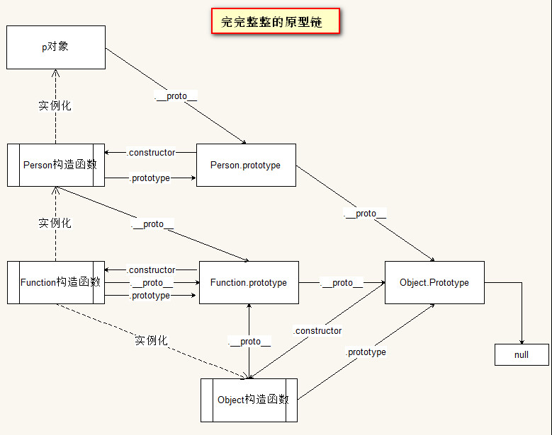

# 实用工具分享
> 工欲善其事必先利其器

  - [Cmder](http://cmder.net/)
     + win下有良好显示界面的终端
     + 

  - [Launchy](http://www.launchy.net/)
     + win下好用的快捷打开软件的软件
     + 

  - [FastStone Capture](http://www.faststone.org/FSCapturerDownload.htm)
     + 截图、取色、量尺寸、录视频、图片转pdf
     + 

  - [DiagramDesigner](http://logicnet.dk/DiagramDesigner/indexChinese.htm)
     + 简洁的流程图绘制工具
     + 

  - [Typora](https://www.typora.io/)
    + 所见即所得的`markdown`编辑器
    + 

  - [Everything](https://www.voidtools.com)
     + 能够找出电脑中所有匹配搜索关键字的内容
     + 

  - [7z](http://www.7-zip.org/)
     + 高效率无广告解压缩软件
     + 
  
  - [SumatraPDF](https://www.sumatrapdfreader.org/download-free-pdf-viewer.html)
     + 轻量级PDF阅读器
     + 

  - [SwitchHosts](https://oldj.github.io/SwitchHosts/)
     + 快速切换hosts
     + 

  - [gnvm](http://ksria.com/gnvm/#getting-started)
     + win下`node`多版本管理器
     + 

  - [ndm](https://720kb.github.io/ndm/#win)
     + 管理项目`node_modules`中的依赖，如：版本更新等
     + 

  - [SourceTree](https://www.sourcetreeapp.com/)
     + `Git`版本控制的客户端软件
     + 

  - [Beyond Compare4](http://www.scootersoftware.com/download.php)
     + 文件对比工具，如：解决代码冲突时用
     + 

  - [Axure RP](https://www.axure.com/download)
     + 设计产品原型的利器
     + 

  - [Fiddler](https://www.telerik.com/download/fiddler)
     + 抓包工具
     + 

  - [Lantern](https://getlantern.org/en_US/)
     + 翻墙....
     + 

  - [f.lux](https://justgetflux.com/)
     + 调节色温，缓解疲劳
     + 

  - [Snipaste](https://sspai.com/34962)
     + 桌面截图 
     + 

  - [KeePass](http://keepass.info/)
     - 生成随机密码和 `KeeFox` 一起使用简直完美
     - 

  - [StrokesPlus](http://www.strokesplus.com/)
     - 鼠标手势软件
  
  - [AutoHotkey](https://autohotkey.com/)
     - 基本是键盘哪里按的不爽就用它去改。
  
  - [Ad Muncher](https://www.admuncher.com/)
     - 免费过滤广告利器
  
  - [OneNote](https://www.onenote.com/)
     - [`Evernote(印象剪藏)`](https://www.yinxiang.com/webclipper/install/) 用来剪藏网页，做笔记得 `OneNote`
  
  - [Telegram](https://telegram.org/)
     - 这是把聊天工具做到极致的典范，而且它还很年轻，还在不断进步，并且也是用 `Qt` 开发的！
