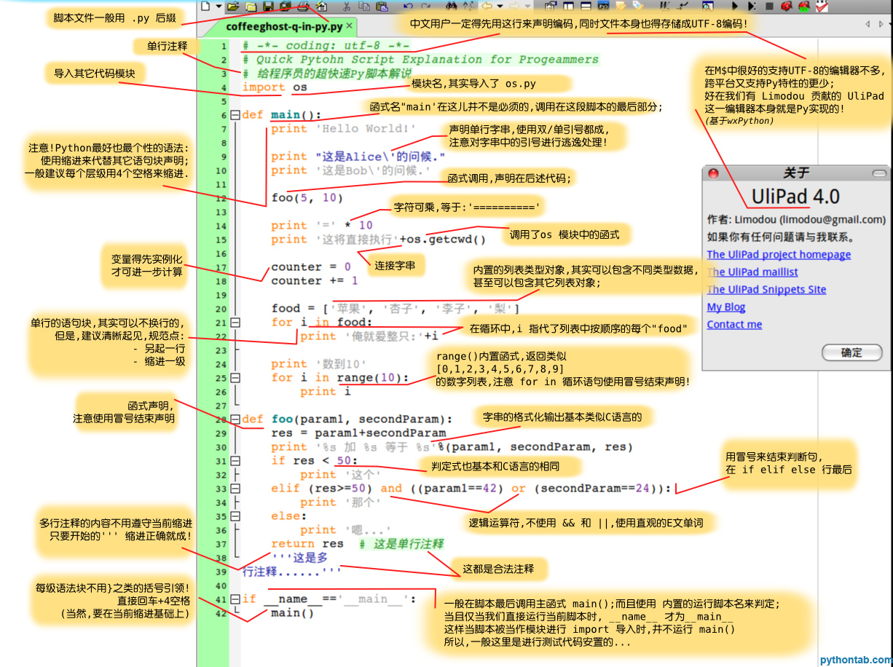
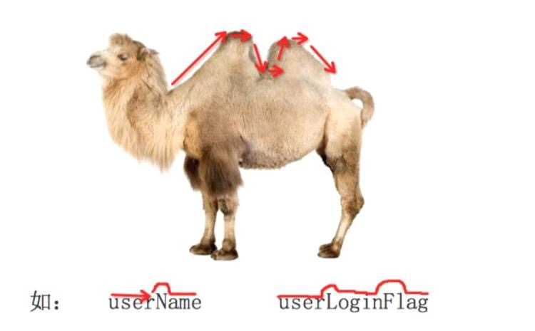

# Grammar

> 一张图让你学会Python




## 注释

- 单行注释

```py

 # 我是注释，可以在里写一些功能说明之类的
    print('hello world')

```

- 多行注释

```py
  
  ''' 我是多行注释，可以写很多的功能说明
      说明内容

  '''

```

- py 程序中文支持

> 推荐使用方法：

```py

# -*- coding:uft-8 -*-

```

## 变量

> 程序就是用来处理数据的， 而变量是用来存储数据的

- 变量类型


- `type`

> 可以使用 `type(变量的名字)` ，查看变量的类型 

- 栗子

```py
  num1 = 100 #num1就是一个变量，就好一个小菜篮子

  num2 = 87  #num2也是一个变量

  result = num1 + num2 #把num1和num2这两个"菜篮子"中的数据进行累加，然后放到 result变量中
```

## 标识符&关键字

- 规则

> 1.标识符由字符、下划线和数字组成，且数字不能开头

> 2.python中标识符区分大小写

- 命名规则

> 1.见名知意

> 2.驼峰命名法



   - 上图分别为: 小驼峰和大驼峰式命名法；

   - 还有一种用下划线'_'来连接所有的单词，如： snoopy_fifi

- 关键字

> 1.查看： `import keyword`

> 2.关键字：

   ```
      and     as      assert     break     class      continue    def     del
      elif    else    except     exec      finally    for         from    global
      if      in      import     is        lambda     not         or      pass
      print   raise   return     try       while      with        yield
   ```

## 输出&&输入

### 输出

- 普通输出

```py
print('snoopy o fifi')
```

- 格式化输出

> 具备 `%` 这样的操作符，就是py的格式化输出

```py

  age = 18
  name = "snoopy"
  print("我叫%s, 年龄是%d"%(name, age))

```

> 常用的格式符号

| 格式符号 |        转换         |
| :--: | :---------------: |
|  %c  |        字符         |
|  %s  | 通过str() 字符串转换来格式化 |
|  %i  |     有符号十进制整数      |
|  %d  |     有符号十进制整数      |
|  %u  |     无符号十进制整数      |
|  %o  |       八进制整数       |
|  %x  |   十六进制整数（小写字母）    |
|  %X  |   十六进制整数（大写字母）    |
|  %e  |    索引符号（小写'e'）    |
|  %E  |    索引符号（大写“E”）    |
|  %f  |       浮点实数        |
|  %g  |     ％f和％e 的简写     |
|  %G  |     ％f和％E的简写      |


- 换行输出

> 在输出的时候，加上 `\n` ，则其后的内容就会另起一行显示

```py
  print("snoopy o fifi\n--------")
```

### 输入

- raw_input("提示信息")

```py
  password = raw_input("请输入密码:")
  print '您刚刚输入的密码是:', password
```

- input()

```py
  a = input()
```

**注意**：

   - `input()` 接受表达式输入，并把值赋给左边变量；
   - 没有`raw_input()`函数，只有`input()`；并且 py3中的`input()`与py2中的`raw_input()`功能一样

## 运算符

- 算术运算符

下面以a=10 ,b=20为例进行计算

| 运算符  | 描述   | 实例                                       |
| ---- | ---- | ---------------------------------------- |
| +    | 加    | 两个对象相加 a + b 输出结果 30                     |
| -    | 减    | 得到负数或是一个数减去另一个数 a - b 输出结果 -10           |
| *    | 乘    | 两个数相乘或是返回一个被重复若干次的字符串 a * b 输出结果 200     |
| /    | 除    | x除以y b / a 输出结果 2                        |
| //   | 取整除  | 返回商的整数部分 9//2 输出结果 4 , 9.0//2.0 输出结果 4.0 |
| %    | 取余   | 返回除法的余数 b % a 输出结果 0                     |
| **   | 幂    | 返回x的y次幂 a**b 为10的20次方， 输出结果 100000000000000000000 |

```
>>> 9/2.0
4.5
>>> 9//2.0
4.0
```

- 赋值运算符

| 运算符  | 描述    | 实例                                 |
| ---- | ----- | ---------------------------------- |
| =    | 赋值运算符 | 把=号右边的结果给左边的变量 num=1+2*3 结果num的值为7 |

```
>>> a, b = 1, 2
>>> a
1
>>> b
2
```

- 复合赋值运算符

| 运算符  | 描述       | 实例                     |
| ---- | -------- | ---------------------- |
| +=   | 加法赋值运算符  | c += a 等效于 c = c + a   |
| -=   | 减法赋值运算符  | c -= a 等效于 c = c - a   |
| *=   | 乘法赋值运算符  | c *= a 等效于 c = c * a   |
| /=   | 除法赋值运算符  | c /= a 等效于 c = c / a   |
| %=   | 取模赋值运算符  | c %= a 等效于 c = c % a   |
| **=  | 幂赋值运算符   | c **= a 等效于 c = c ** a |
| //=  | 取整除赋值运算符 | c //= a 等效于 c = c // a |


## 常用数据类型转换

| 函数                     |              说明               |
| ---------------------- | :---------------------------: |
| int(x [,base ])        |           将x转换为一个整数           |
| long(x [,base ])       |          将x转换为一个长整数           |
| float(x )              |          将x转换到一个浮点数           |
| complex(real [,imag ]) |            创建一个复数             |
| str(x )                |         将对象 x 转换为字符串          |
| repr(x )               |        将对象 x 转换为表达式字符串        |
| eval(str )             | 用来计算在字符串中的有效Python表达式,并返回一个对象 |
| tuple(s )              |         将序列 s 转换为一个元组         |
| list(s )               |         将序列 s 转换为一个列表         |
| chr(x )                |         将一个整数转换为一个字符          |
| unichr(x )             |       将一个整数转换为Unicode字符       |
| ord(x )                |         将一个字符转换为它的整数值         |
| hex(x )                |       将一个整数转换为一个十六进制字符串       |
| oct(x )                |       将一个整数转换为一个八进制字符串        |


## 比较（关系）运算符&逻辑运算符

- 比较运算符

| 运算符  | 描述                               | 示例                                    |
| ---- | -------------------------------- | ------------------------------------- |
| ==   | 检查两个操作数的值是否相等，如果是则条件变为真。         | 如a=3,b=3则（a == b) 为 true.             |
| !=   | 检查两个操作数的值是否相等，如果值不相等，则条件变为真。     | 如a=1,b=3则(a != b) 为 true.             |
| <>   | 检查两个操作数的值是否相等，如果值不相等，则条件变为真。     | 如a=1,b=3则(a <> b) 为 true。这个类似于 != 运算符 |
| >    | 检查左操作数的值是否大于右操作数的值，如果是，则条件成立。    | 如a=7,b=3则(a > b) 为 true.              |
| <    | 检查左操作数的值是否小于右操作数的值，如果是，则条件成立。    | 如a=7,b=3则(a < b) 为 false.             |
| >=   | 检查左操作数的值是否大于或等于右操作数的值，如果是，则条件成立。 | 如a=3,b=3则(a >= b) 为 true.             |
| <=   | 检查左操作数的值是否小于或等于右操作数的值，如果是，则条件成立。 | 如a=3,b=3则(a <= b) 为 true.             |

- 逻辑运算符


| 运算符  | 逻辑表达式   | 描述                                       | 实例                    |
| ---- | ------- | ---------------------------------------- | --------------------- |
| and  | x and y | 布尔"与" - 如果 x 为 False，x and y 返回 False，否则它返回 y 的计算值。 | (a and b) 返回 20。      |
| or   | x or y  | 布尔"或" - 如果 x 是 True，它返回 True，否则它返回 y 的计算值。 | (a or b) 返回 10。       |
| not  | not x   | 布尔"非" - 如果 x 为 True，返回 False 。如果 x 为 False，它返回 True。 | not(a and b) 返回 False |


## 判断语句

- `if`

- `if-else`

```py
  love = 1 # 用1代表真爱，0代表假爱
  if love == 1:
      print('ture love -> make love')
  else:
      print('to die')
```

- `elif`

```py
   if 性别为男性:
       输出男性的特征
       ...
   elif 性别为女性:
       输出女性的特征
       ...
   else:
       第三种性别的特征
       ...
```

- `if` 的嵌套

```py
  love = 1 # 用1代表真爱， 0代表假爱
  len = 15 # 长度...

  if love == 1:
      print('true love -> make love')
      if len > 10: 
          print('oh year, oh year ...')
      else:
          print('to die')
  else: 
      print('to die')

```


## 循环

### `while` 循环

```py
  i = 0
  while i<5:
      print("当前是第%d次执行循环"%(i+1))
      print("i=%d"%i)
      i+=1
```

### `for` 循环

> 在py中，`for`循环可以遍历任何序列的项目，如一个列表或者一个字符串等

```py
  name = 'snoopy'
  for x in name: 
      print(x)
```

### `bread` & `continue`

- continue

```py
  i = 0

  while i<10:
      i = i+1
      print('----')
      if i==5:
          continue
      print(i)
```

- breack

```py
  name = 'dongGe'

  for x in name:
      print('----')
      if x == 'g': 
          break
      print(x)
```

**注意**：

   > break 用来结束整个循环；
   > continue 用来结束本次循环，将会继续下一次循环；
   > break/continue在嵌套循环中，只对最近的一层循环起作用。

