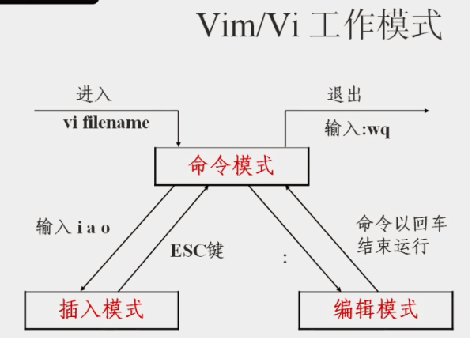

# shell

## `Linux`常用命令

- [`Linux`命令大全](http://code.ziqiangxuetang.com/linux/linux-command-manual.html)

- [`Linux` 命令大全搜索](http://man.linuxde.net/)

> 处理文件目录常用命令

- `pwd`: 显示当前所在目录
- `ls`: 列出目录
- `cd`：切换目录
- `pwd`：显示目前的目录
- `mkdir`：创建一个新的目录
- `rmdir`：删除一个空的目录
- `cp`: 复制文件或目录
- `rm`: 移除文件或目录
- `touch`: 文件不存在即新建文件，否则为修改文件或目录的存取和更改时间

> 打开`pdf/html`文件

- `firefox http://www.google.com` : 打开网站用 `firefox` 命令；
- `evince  xx.pdf` : 打开pdf时，用 `evince` 命名；

## `vi`/`vim` 的使用

[vi/vim使用](http://code.ziqiangxuetang.com/linux/linux-vim.html)

**一般模式**：

以 vi 打开一个档案就直接进入一般模式了(这是默认的模式)。
在这个模式中， 你可以使用『上下左右』按键来移动光标，你可以使用『删除字符』或『删除整行』来处理档案内容， 也可以使用『复制、贴上』来处理你的文件数据。

**编辑模式**：

在一般模式中可以进行删除、复制、贴上等等的动作，但是却无法编辑文件内容的！ 
要等到你按下『i, I, o, O, a, A, r, R』等任何一个字母之后才会进入编辑模式。
注意了！通常在 Linux 中，按下这些按键时，在画面的左下方会出现『INSERT 或 REPLACE 』的字样，此时才可以进行编辑。.
而如果要回到一般模式时， 则必须要按下『Esc』这个按键即可退出编辑模式。

**指令列命令模式**：

在一般模式当中，输入『 : / ? 』三个中的任何一个按钮，就可以将光标移动到最底下那一行。
在这个模式当中， 可以提供你『搜寻资料』的动作，而读取、存盘、大量取代字符、离开 vi 、显示行号等等的动作则是在此模式中达成的！

