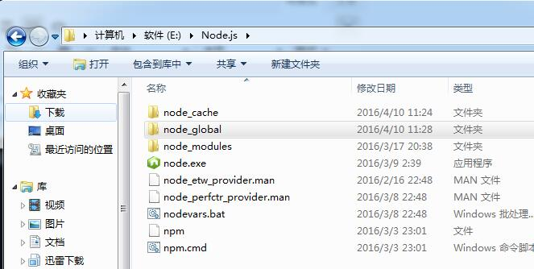
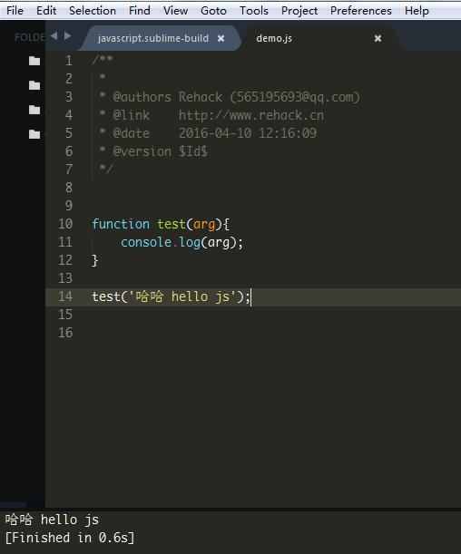

# 高级用法

## 配置编译js环境

> 在sublime中调试js

1. 安装配置node.js环境

- 在node.js的安装根目录新建两个文件夹：node_cache 和 node_global

- 然后在cmd里分别执行命令：
```
  npm config set prefix "D:\Node.js\node_global"
  npm config set cache "D:\Node.js\node_cache"
```

**注意**：D:\Node.js\这个改成你自己的nodejs安装路径

2. 配置sublime编译js

- 打开sublime，选择菜单 Tools --> Build System --> new Build System...（中文版的话是 工具 --> 编译系统 --> 新建编译系统...）

- 将下面的内容粘贴进去：

```json
{
    "cmd": ["node", "$file"],
    "file_regex": "^[ ]*File \"(...*?)\", line ([0-9]*)",
    "working_dir": "${file_path}",
    "selector": "source.js",
    "shell": true,
    "encoding": "utf-8",
    "windows": {
        "cmd": ["node", "$file"]
    },
    "linux": {
        "cmd": ["killall node; node", "$file"]
    }
}
```

- 接着保存为 javascript.sublime-build，保存位置默认即可。

3. 测试

新建一个demo.js文件，随便写点js代码按快捷键`Ctrl+B`或者`F7`测试一下：


