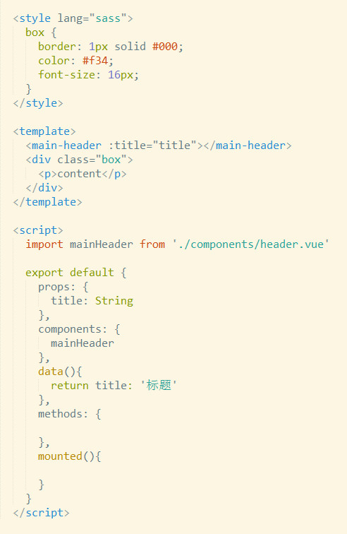

# Introduce

## 组件

### 声明组件

- 普通组件声明

> 声明组件

```js

// `Vue` 实例化
  var Vue = new Vue();

// 声明组件
  Vue.component('snoopy-component', {

  // 模板
    template: '<div> {{msg}} {{parivateMsg}} </div>',

  // 接受参数
    props: {
      msg: 'Snoopy love Fifi'
    },

  // 私有数据，需要在函数中返回以避免多个实例共享一个对象
    data: function(){
      return {
        privateMsg: 'Me too!'
      }
    }

  })
 

```

> 调用声明好的组件

```
  <div id="parentBox">
    <snoopy-component> </snoopy-component> // 调用声明的组件
  </div>
```

**注意**：若组件名称为驼峰命名，调用时改成 `-`

- 单文件组件声明




